# The Sharp Chair — Barber Shop Booking System

   

---

## Live Site

[https://the-sharp-chair-3f9e41c19275.herokuapp.com/](https://the-sharp-chair-3f9e41c19275.herokuapp.com/)

**GitHub Repository:** [https://github.com/yavorgeorgiev2004/TheSharpChair](https://github.com/yavorgeorgiev2004/TheSharpChair)

---

## Table of Contents

1. [Project Purpose and Rationale](#1-project-purpose-and-rationale)
2. [Target Audience and User Stories](#2-target-audience-and-user-stories)
3. [UX and UI Design](#3-ux-and-ui-design)
4. [Wireframes](#4-wireframes)
5. [Database Design](#5-database-design)
6. [Features](#6-features)
7. [Django Templates](#7-django-templates)
8. [Security](#8-security)
9. [Testing](#9-testing)
10. [Validation](#10-validation)
12. [Bugs](#12-bugs)
13. [Deployment](#13-deployment)
14. [How to Use the Application](#14-how-to-use-the-application)
15. [Technologies Used](#15-technologies-used)
16. [Credits and Attributions](#16-credits-and-attributions)
17. [File-by-File Code Reference](#17-file-by-file-code-reference)

---

## 1. Project Purpose and Rationale

The Sharp Chair is a full-stack web application designed to solve a genuine operational problem faced by small barber shops. Before this system, the shop relied entirely on telephone calls and a paper diary to manage appointments. This created repeated problems: double bookings when two staff members accepted calls simultaneously, missed appointments when diary entries were illegible, and no way for customers to book outside of trading hours.

The application replaces this system entirely. Customers can register an account, browse services, select a barber, choose from dynamically generated available time slots, and confirm a booking from any internet-connected device at any time of day. Barbers log in to a separate dashboard showing only their own schedule with customer contact details. The shop owner manages all data through a built-in administration panel that requires no technical knowledge to operate.

The project is built on Django 5.2 and PostgreSQL, following the Model-View-Template architectural pattern. Data is stored in a fully normalised relational database. All sensitive configuration is managed through environment variables. The application is deployed live on Heroku.

---

## 2. Target Audience and User Stories

### 2.1 Customers

| User Story | Acceptance Criteria |
|---|---|
| As a customer I want to register an account so I can manage bookings online | Registration form creates account and logs me in automatically |
| As a customer I want to browse services and prices before booking | Services page lists all active services with name, description, price and duration |
| As a customer I want to choose a specific barber | Booking wizard step 2 shows all available barbers with their speciality |
| As a customer I want to see which time slots are available for my chosen date | Slots load dynamically via AJAX when I select a date |
| As a customer I want a booking reference after confirming | Confirmation page shows a unique reference number |
| As a customer I want to view all my bookings in one place | My Bookings lists all bookings with status badges and action buttons |
| As a customer I want to edit an upcoming booking | Edit booking page allows changing date, time and notes |
| As a customer I want to cancel a booking | Cancel page asks for optional reason and changes booking status to cancelled |

### 2.2 Barbers

| User Story | Acceptance Criteria |
|---|---|
| As a barber I want to log in and see only my own appointments | My Schedule shows only bookings assigned to me ordered chronologically |
| As a barber I want to see customer contact details | Each booking shows customer name and email |
| As a barber I want to cancel an appointment if needed | Cancel button on schedule redirects back to schedule after cancellation |

### 2.3 Shop Owner

| User Story | Acceptance Criteria |
|---|---|
| As a shop owner I want to manage all bookings across all barbers | Admin panel shows all bookings with search, filter and inline status editing |
| As a shop owner I want to manage the services offered | Admin allows creating, editing and deactivating services |
| As a shop owner I want to create barber accounts | Admin allows creating a User and linking a Barber profile to it |
| As a shop owner I want to view cancellation records | Cancellation records show who cancelled, when and why |

---

## 3. UX and UI Design

### 3.1 Design Philosophy

The design reflects the premium positioning of a professional barber shop. The visual identity draws on traditional barbershop aesthetics — dark backgrounds, gold accents, strong typography — combined with a modern layout that communicates quality. The interface prioritises clarity and efficiency. A customer should complete a booking in under two minutes. A barber should see everything they need at a glance.

### 3.2 Colour Palette

| Variable | Hex | Usage |
|---|---|---|
| `--black` | `#0d0d0d` | Page background |
| `--dark` | `#141414` | Card backgrounds |
| `--gold` | `#c9a84c` | Primary accent, buttons, highlights |
| `--cream` | `#f5f0e8` | Primary text |
| `--muted` | `#888888` | Secondary text and labels |
| `--red` | `#c0392b` | Error states and cancel actions |
| `--green` | `#27ae60` | Success states and confirmed status |

All colours are defined as CSS custom properties in `:root`. Changing a colour in one place updates it across the entire application.

### 3.3 Typography

| Font | Usage |
|---|---|
| Bebas Neue | Display headings, logo, navigation, statistics |
| DM Sans | Body text, forms, labels |
| Playfair Display | Hero title italic accent |
| Courier New | Booking reference numbers |

### 3.4 Responsive Breakpoints

| Breakpoint | Behaviour |
|---|---|
| Above 900px | Full desktop layout, two-column hero |
| 600px — 900px | Tablet — hero collapses, nav compresses |
| Below 600px | Mobile — all elements stack vertically |
| Below 400px | Small phone — minimum font sizes and padding |

---

## 4. Wireframes

### 4.1 Desktop — Home Page

```
┌─────────────────────────────────────────────────────────────────┐
│ THE SHARP CHAIR    Home  Services  My Bookings  Sign Out  [BOOK]│
├──────────────────────────────────┬──────────────────────────────┤
│                                  │                              │
│  Est. 2009 · Wolverhampton       │         ┌────┐               │
│                                  │         │    │  BARBER       │
│  THE                             │         │████│  POLE         │
│  SHARP                           │         │    │  (animated)   │
│  Chair                           │         └────┘               │
│                                  │                              │
│  Precision cuts, classic shaves  │    ┌──────────────────┐      │
│  and modern styles.              │    │ MON — FRI        │      │
│                                  │    │ 8am — 8pm        │      │
│  [BOOK APPOINTMENT] [SERVICES]   │    │ Sat & Sun Closed │      │
│                                  │    └──────────────────┘      │
│  15+ Years  3 Barbers  Mon–Fri   │                              │
│                                  │                              │
├──────────────────────────────────┴──────────────────────────────┤
│  ✂️ Precision   │  📅 Easy      │  🪒 Classic  │  💈 3 Expert  │
│  Cutting        │  Booking      │  Shaves       │  Barbers      │
└─────────────────────────────────────────────────────────────────┘
```

### 4.2 Desktop — Booking Wizard Step 3

```
┌─────────────────────────────────────────────────────────────────┐
│ NAV                                                             │
├─────────────────────────────────────────────────────────────────┤
│         ①Service ──── ②Barber ──── ③Date & Time ──── ④Confirm   │
│                                                                 │
│  DATE & TIME                                                    │
│  Open Monday–Friday 8am–8pm. Weekends closed.                   │
│                                                                 │
│  ┌─────────────────────┐  ┌──────────────────────────────────┐  │
│  │ SELECT DATE         │  │ AVAILABLE TIMES                  │  │
│  │ [   date picker   ] │  │ [08:00] [08:30] [09:00] [09:30]  │  │
│  │                     │  │ [10:00] [10:30] [11:00] [11:30]  │  │
│  └─────────────────────┘  └──────────────────────────────────┘  │
│                                                                 │
│  ┌──────────────────────────────────────────────────────────┐   │
│  │ Service: Classic Haircut  │  Barber: James  │  30 min    │   │
│  └──────────────────────────────────────────────────────────┘   │
│                                                                 │
│  [← Back]                                      [Continue →]     │
└─────────────────────────────────────────────────────────────────┘
```

### 4.3 Desktop — My Bookings

```
┌─────────────────────────────────────────────────────────────────┐
│ NAV                                                             │
├─────────────────────────────────────────────────────────────────┤
│ MY BOOKINGS                                                     │
│                                                                 │
│ ┌─────────────────────────────────────────────────────────┐     │
│ │ CLASSIC HAIRCUT                          [CONFIRMED]    │     │
│ │ 📅 Mon, 5 Jan 2025  🕐 10:00  💈 James  £18            │     │
│ │ REF: #SC3F7A9B2E                    [Edit] [Cancel]     │     │
│ └─────────────────────────────────────────────────────────┘     │
│                                                                 │
│ ┌─────────────────────────────────────────────────────────┐     │
│ │ FADE & BLEND                             [CANCELLED]    │     │
│ │ 📅 Fri, 20 Dec 2024  🕐 14:00  💈 Marcus  £22          │     │
│ │ REF: #SC7A2B9C1D                                        │     │
│ └─────────────────────────────────────────────────────────┘     │
└─────────────────────────────────────────────────────────────────┘
```

### 4.4 Tablet — Home Page (~768px)

```
┌─────────────────────────────────┐
│ THE SHARP CHAIR  Svc  [BOOK NOW]│
├─────────────────────────────────┤
│                                 │
│  Est. 2009 · Wolverhampton      │
│                                 │
│  THE                            │
│  SHARP                          │
│  Chair                          │
│                                 │
│  Precision cuts...              │
│                                 │
│  [BOOK APPOINTMENT]             │
│  [VIEW SERVICES]                │
│                                 │
│  15+ Years  3 Barbers  Mon–Fri  │
│                                 │
├─────────────────┬───────────────┤
│ ✂️ Precision    │ 📅 Easy Book │
│ Cutting         │               │
├─────────────────┼───────────────┤
│ 🪒 Classic      │ 💈 3 Barbers │
│ Shaves          │               │
└─────────────────┴───────────────┘
```

### 4.5 Mobile — Home Page (~375px)

```
┌──────────────────────┐
│THE SHARP  Home  BOOK │
│CHAIR      Svc        │
├──────────────────────┤
│ Est. 2009            │
│                      │
│ THE                  │
│ SHARP                │
│ Chair                │
│                      │
│ Precision cuts,      │
│ classic shaves and   │
│ modern styles.       │
│                      │
│ [BOOK APPOINTMENT]   │
│ [VIEW SERVICES]      │
│                      │
│ 15+  3  Mon–Fri      │
├──────────────────────┤
│ ✂️ Precision Cutting │
├──────────────────────┤
│ 📅 Easy Booking      │
├──────────────────────┤
│ 🪒 Classic Shaves    │
├──────────────────────┤
│ 💈 3 Expert Barbers  │
└──────────────────────┘
```

### 4.6 Mobile — Booking Wizard (~375px)

```
┌──────────────────────┐
│ NAV                  │
├──────────────────────┤
│  ① ──── ② ──── ③ ── ④│
│                      │
│  DATE & TIME         │
│                      │
│  [   date picker   ] │
│                      │
│  AVAILABLE TIMES     │
│  [08:00] [08:30]     │
│  [09:00] [09:30]     │
│  [10:00] [10:30]     │
│                      │
│ [← Back] [Next →]    │
└──────────────────────┘
```

---

## 5. Database Design

### 5.1 Schema Diagram


The schema shows all six tables, their columns and data types, primary and foreign key relationships, and the UNIQUE constraint on the booking table that prevents double booking at the database level.

### 5.2 Tables and Purpose

| Table | Purpose |
|---|---|
| `auth_user` | Django built-in — handles all authentication. Passwords are PBKDF2 hashed. Never modified directly in code. |
| `bookings_userprofile` | Extends auth_user with customer phone number. Created automatically on registration. |
| `bookings_barber` | Marks a user as a barber. Role detection happens by checking if this record exists for a user — no separate roles table needed. |
| `bookings_service` | Lookup table for services. Referenced by bookings. Cannot be deleted if bookings reference it. |
| `bookings_booking` | Core transaction table. One row per appointment. Three foreign keys connect it to customer, barber and service. |
| `bookings_cancellation` | Audit table. Created when a booking is cancelled. Records who cancelled, when and why. The booking row itself is never deleted. |

### 5.3 Relationships

**auth_user → bookings_userprofile — One to One**
One user has exactly one customer profile. Django's `OneToOneField` adds a UNIQUE constraint to `user_id` in the database.

**auth_user → bookings_barber — One to One**
One user can be linked to one barber profile. The presence of this record is the role detection mechanism. `hasattr(request.user, 'barber')` returns True for barbers and False for customers.

**auth_user → bookings_booking — One to Many**
One customer can have many bookings. The `customer_id` foreign key appears in multiple booking rows.

**bookings_barber → bookings_booking — One to Many**
One barber can be assigned to many bookings. The `barber_id` foreign key appears in multiple booking rows.

**bookings_service → bookings_booking — One to Many**
One service can appear in many bookings. `on_delete=PROTECT` prevents deleting a service that bookings reference.

**bookings_booking → bookings_cancellation — One to One**
One booking can only be cancelled once. `OneToOneField` on `booking_id` enforces this.

### 5.4 Data Integrity

**Double booking prevention — two independent layers:**

- Layer 1 (Python): `clean()` in `models.py` uses the interval overlap algorithm before any database write. A conflict exists when `existing.start_time < candidate.end_time AND existing.end_time > candidate.start_time`.
- Layer 2 (Database): `UNIQUE(barber_id, date, start_time)` in PostgreSQL physically rejects a conflicting INSERT even if Python validation fails.

**Referential integrity:**
- `on_delete=CASCADE` on customer and barber keys — deleting a user removes their records
- `on_delete=PROTECT` on service key — prevents deleting a service that bookings reference
- `on_delete=SET_NULL` on `cancelled_by` — preserves the audit record if the cancelling user later deletes their account

### 5.5 Normalisation

The schema avoids data duplication throughout. Barber names are stored once in `auth_user` and referenced by ID in every booking. If a barber updates their name the change is reflected everywhere automatically. Service prices are stored once in `bookings_service` — updating a price does not affect existing booking records. Every piece of information lives in exactly one place.

---

## 6. Features

### Implemented

- User registration with email duplicate checking and phone number collection
- Login and logout with Django session management
- Role-aware navigation — customers see My Bookings, barbers see My Schedule
- Four-step booking wizard with session persistence across HTTP requests
- Real-time time slot generation using interval overlap algorithm
- AJAX date picker — available slots load without page reload
- Double booking prevention at Python and database level
- Unique booking reference auto-generation (SC + 8 random hex characters)
- Customer dashboard with booking history, status badges, edit and cancel actions
- Barber dashboard showing customer contact details and appointment time range
- Soft delete pattern with cancellation audit trail
- Django admin panel with search, filter, date hierarchy and inline editing
- Fully responsive layout across mobile, tablet and desktop
- Flash message system for user feedback after all actions
- Whitenoise static file serving in production
- PostgreSQL on Heroku, SQLite locally — automatic switching via environment variable

### Future Features

- Email confirmation on booking
- SMS reminders 24 hours before appointment
- Online payment via Stripe
- Barber availability calendar for blocking days off
- Customer review and rating system
- Repeat booking with one click from booking history

---

## 7. Django Templates

Django's template system separates presentation from logic. Views pass data to templates as a context dictionary. Templates use `{{ }}` tags to output values and `` tags for logic such as loops and conditionals. This keeps Python code out of HTML and HTML out of Python — each layer has a single clearly defined responsibility.

### 7.1 Template Syntax

The following template syntax features are used throughout the project.

| Syntax | Example | Purpose |
|---|---|---|
| Variable output | `{{ booking.service.name }}` | Outputs a Python value into the HTML. The dot notation traverses foreign key relationships automatically. |
| For loop | `` | Iterates over a QuerySet passed from the view. Generates repeated HTML blocks — one per booking card. |
| Empty block | `` | Renders fallback content when a QuerySet has zero results. Used in my_bookings.html and services.html. |
| If statement | `` | Conditionally renders HTML elements based on data values. Drives badge colours and button visibility. |
| URL generation | `` | Generates the correct URL by name rather than hardcoding paths. If a URL changes, templates update automatically. |
| Static files | `` | Generates the correct URL for static files including the content hash added by whitenoise in production. |
| CSRF token | `` | Injects a hidden security token into every POST form. Django validates it on submission to prevent cross-site request forgery. |
| Template filter | `{{ booking.date\|date:"D, j M Y" }}` | Transforms a Python date object into a readable string. The pipe character applies the filter. |
| Default filter | `{{ user.first_name\|default:user.username }}` | Returns the username if first_name is empty — prevents blank output in the nav sign out link. |
| Load tag | `` | Loads the static files template tag library before any `` tags can be used. |
| Block tag | `` | Defines a named slot in base.html that child templates fill with their unique content. |
| Extends tag | `` | Inherits the full structure of base.html. Must be the absolute first line of any child template. |
| Include tag | `` | Inserts a partial template and passes a variable to it. Used for the booking wizard step indicator. |

### 7.2 Template Logic

**Role-aware navigation** in `base.html` uses nested conditionals to show different links depending on who is logged in:

```html

    
        <a href="">My Schedule</a>
    
        <a href="">My Bookings</a>
    

    <a href="">Sign In</a>

```

`` checks whether a Barber database record exists for the logged-in user. No separate roles table is needed — the foreign key relationship in the database is the role.

**Status badge logic** in `my_bookings.html` uses chained conditionals to apply different badge colours:

```html

    <span class="badge badge-cancelled">Cancelled</span>

    <span class="badge badge-completed">Past</span>

    <span class="badge badge-confirmed">{{ booking.get_status_display }}</span>

```

**Context variable injection** — the home page stats section uses `{{ barbers.count }}` which calls `.count()` on the QuerySet passed from `views.home()`, generating a `SELECT COUNT(*)` SQL query. The page always shows the live number of available barbers without any hardcoded values.

### 7.3 Template Inheritance

Template inheritance eliminates code duplication across all 13 pages. `base.html` defines the full page structure with named block placeholders. Every child template extends it and fills in only its unique content.

```
base.html
  ├── Navigation (written once — appears on all 13 pages)
  ├── Flash messages (written once — appears on all 13 pages)
  ├──   ← each child template fills this
  └── Footer (written once — appears on all 13 pages)
```

Changing the navigation in `base.html` updates every page in the application simultaneously. Without inheritance, the same HTML would need to be copied and maintained in all 13 template files.

### 7.4 Partial Templates

`bookings/templates/bookings/partials/step_progress.html` is a reusable fragment included in all four booking wizard steps:

```html

```

The `with step=1` passes the current step number to the partial. The partial uses `` logic to apply active, done or future CSS classes to each bubble. Writing this once and including it four times means a change to the progress indicator updates all wizard steps at once.

### 7.5 Template Filters Used

| Filter | Example | Output |
|---|---|---|
| `date` | `{{ booking.date\|date:"D, j M Y" }}` | Mon, 5 Jan 2025 |
| `time` | `{{ booking.start_time\|time:"H:i" }}` | 09:30 |
| `default` | `{{ user.first_name\|default:user.username }}` | Falls back to username if first_name is empty |
| `floatformat` | `{{ service.price\|floatformat:2 }}` | 18.00 |

---

## 8. Security

| Feature | Implementation |
|---|---|
| Secret key | Read from environment variable via python-decouple. Never in codebase or version control. `.env` in `.gitignore`. |
| Debug mode | `DEBUG=False` on Heroku via config var. Prevents error page code exposure to users. |
| CSRF protection | `` on every POST form. Django's `CsrfViewMiddleware` validates on every submission. |
| Authentication | `@login_required` decorator on all booking and account views. Unauthenticated users redirect to `/login/`. |
| Authorisation | `get_object_or_404(Booking, id=id, customer=request.user)` — users can only access their own records. A guessed URL returns 404 not data. |
| Password hashing | Django uses PBKDF2 with SHA256. Passwords never stored in plain text. |
| Data integrity | `ON DELETE PROTECT` on service foreign key. `UNIQUE` constraint prevents double booking. |
| Input validation | Django form pipeline rejects invalid dates, weekends, past dates and overlapping slots before any database write. |

### 8.1 DEBUG Mode — Local vs Production

The `settings.py` file contains the following line:

```python
DEBUG = config('DEBUG', default=False, cast=bool)
```

The `default=False` means DEBUG is off by default in all environments. This satisfies the production security requirement and ensures the application is safe even if no environment variable is set.

**How it works in each environment:**

| Environment | How DEBUG is set | Value |
|---|---|---|
| Local development | `DEBUG=True` explicitly set in `.env` file | `True` |
| Heroku production | `DEBUG=False` set as a Config Var in Heroku dashboard | `False` |
| Any environment with no variable set | Falls back to `default=False` | `False` |

**Why `default=False` is the correct choice:**

Setting `default=False` means the application fails safe — if no environment variable is configured, DEBUG is off rather than on. This protects against accidental deployment without configuration where sensitive error pages and stack traces could be exposed to the public.

Local development works correctly because `DEBUG=True` is set explicitly in the `.env` file, which overrides the default. The `.env` file is in `.gitignore` and is never committed to GitHub.

**Verification that DEBUG is False on Heroku:**

```bash
heroku config --app the-sharp-chair
```

Output:

```
DEBUG: False
```

**For anyone running this project locally:**

After cloning the repository, create a `.env` file and set `DEBUG=True` to enable detailed error pages during development. See the Local Development Setup section for full instructions.

Reference: Django deployment checklist — [https://docs.djangoproject.com/en/5.2/howto/deployment/checklist/#debug](https://docs.djangoproject.com/en/5.2/howto/deployment/checklist/#debug)
Reference: Twelve-Factor App — Config — [https://12factor.net/config](https://12factor.net/config)

---

### 8.2 Potential Misuse and Threats

Any online booking system that allows members of the public to create accounts and reserve time slots is vulnerable to several forms of misuse. The following threats were considered during development.

**Fake account creation and slot hoarding**

A bad actor could create multiple accounts and book every available slot across multiple dates, preventing real customers from booking. This is a known attack on ticket and appointment systems sometimes called slot squatting. The current application does not implement rate limiting on account creation or booking submission, which means this risk exists. Future mitigations would include limiting the number of active bookings per account at any one time, adding email verification on registration to prevent throwaway accounts, and implementing rate limiting on the booking endpoints using Django's cache framework or a package such as django-ratelimit.

**Reselling booked slots**

Because appointments are tied to a named account and a specific barber, date and time, there is limited opportunity to resell slots. A booking confirmation shows only a reference number — it does not function as a transferable ticket. The barber sees the customer name and email on their schedule, so turning up with someone else's reference would not grant entry to the appointment. The shop owner can also view and cancel any booking via the admin panel if misuse is suspected.

**Automated form submission (bots)**

The registration and booking forms do not currently include a CAPTCHA challenge, which means automated scripts could theoretically submit forms in bulk. Django's CSRF protection blocks cross-origin form submissions, but a bot running on the same domain or manually obtaining a CSRF token could still submit forms. A future mitigation would be to add Google reCAPTCHA v3 or a honeypot field to the registration and booking forms to detect and block automated submissions.

**Brute force login attempts**

Django does not limit failed login attempts by default. A brute force attack that tries many passwords against a known username is theoretically possible. The password hashing algorithm (PBKDF2 with SHA256) makes this computationally expensive, but a future mitigation would be to add account lockout after a set number of failed attempts using a package such as django-axes, which tracks failed login attempts per IP address and per username.

**SQL injection**

Django's ORM parameterises all database queries automatically. Raw SQL is never written anywhere in this project. This means SQL injection attacks — where malicious input attempts to manipulate database queries — are not possible through any user-facing input in the application.

**Cross-Site Scripting (XSS)**

Django's template engine escapes all variable output by default. Any user-submitted content such as booking notes is rendered as plain text rather than HTML, preventing script injection attacks where a malicious user attempts to execute JavaScript in another user's browser session.

**Unauthorised data access**

Every view that returns user data filters by `customer=request.user` or `barber=request.user.barber`. A customer who guesses or constructs a URL pointing at another customer's booking receives a 404 response — not the data. This prevents horizontal privilege escalation where one authenticated user accesses another user's records.

**Admin panel exposure**

The Django admin panel at `/admin/` is protected by Django's staff authentication system. Only accounts with `is_staff=True` can access it. The admin URL is not hidden or obscured — security by obscurity is not relied upon — but the authentication requirement means the panel is inaccessible without valid staff credentials. The `ALLOWED_HOSTS` setting restricts the domains the application will respond to, preventing host header injection attacks.

### 8.3 Future Security Improvements

The following security features were identified as appropriate for a future development iteration:

- Email verification on registration to prevent throwaway accounts
- Rate limiting on booking and registration endpoints using django-ratelimit
- CAPTCHA on registration and booking forms to block automated submissions
- Account lockout after repeated failed login attempts using django-axes
- Maximum active bookings per account to prevent slot hoarding
- Automated security scanning using Django's `check --deploy` management command in the CI pipeline

---

## 9. Testing

### 9.1 Testing Approach

Manual testing was carried out across four categories throughout the development process and on the final live Heroku deployment. Every test was performed on Chrome, Safari and Firefox across desktop, tablet and mobile screen sizes.

**Functionality testing** verifies that every feature works as intended — forms submit correctly, data is saved to the database, the booking wizard completes successfully, and all user actions produce the correct outcome.

**Usability testing** verifies that the application is intuitive and easy to use — error messages are clear and helpful, users are redirected appropriately after each action, and the booking process can be completed without confusion.

**Responsiveness testing** verifies that every page displays correctly across all screen sizes without content being cut off, overflowing, or becoming unusable on mobile or tablet devices.

**Accessibility testing** verifies that the application is navigable and readable — all form fields have labels, all images have alt text, colour contrast is sufficient, and the application can be used with keyboard navigation.

---

### 9.2 Navigation and Links — All Pages

Every page was tested to confirm all navigation links, buttons and internal links work correctly and direct the user to the correct destination.

| Page | Element | Expected Destination | Pass / Fail |
|---|---|---|---|
| All pages | Logo — THE SHARP CHAIR | Home page / | Pass |
| All pages | Nav — Home link | Home page / | Pass |
| All pages | Nav — Services link | Services page /services/ | Pass |
| All pages (logged in customer) | Nav — My Bookings link | My Bookings /my-bookings/ | Pass |
| All pages (logged in barber) | Nav — My Schedule link | Barber schedule /schedule/ | Pass |
| All pages (logged in) | Nav — Sign Out link | Logs out, redirects to home | Pass |
| All pages (logged out) | Nav — Sign In link | Login page /login/ | Pass |
| All pages | Nav — Book Now button | Book wizard step 1 /book/ | Pass |
| Home page | Book Appointment button | Book wizard step 1 /book/ | Pass |
| Home page | View Services button | Services page /services/ | Pass |
| Services page | Book This → link on each card | Book wizard step 1 /book/ | Pass |
| Services page | Book Appointment → bottom CTA | Book wizard step 1 /book/ | Pass |
| Login page | Create one link | Register page /register/ | Pass |
| Register page | Sign in link | Login page /login/ | Pass |
| Book Step 1 | ← Home button | Home page / | Pass |
| Book Step 1 | Continue → button (with selection) | Book step 2 /book/barber/ | Pass |
| Book Step 2 | ← Back button | Book step 1 /book/ | Pass |
| Book Step 2 | Continue → button (with selection) | Book step 3 /book/datetime/ | Pass |
| Book Step 3 | ← Back button | Book step 2 /book/barber/ | Pass |
| Book Step 3 | Continue → button (with slot selected) | Book step 4 /book/details/ | Pass |
| Book Step 4 | ← Back button | Book step 3 /book/datetime/ | Pass |
| Book Step 4 | Confirm & Book button | Booking confirmed page | Pass |
| Booking Confirmed | View My Bookings button | My Bookings /my-bookings/ | Pass |
| Booking Confirmed | Book Another button | Book step 1 /book/ | Pass |
| My Bookings | Edit button on each booking | Edit booking page | Pass |
| My Bookings | Cancel button on each booking | Cancel booking page | Pass |
| Edit Booking | ← Cancel button (no save) | My Bookings /my-bookings/ | Pass |
| Edit Booking | Save Changes button | My Bookings with updated booking | Pass |
| Cancel Booking | ← Keep Booking button | My Bookings /my-bookings/ | Pass |
| Cancel Booking | Yes Cancel Booking button | My Bookings with cancelled status | Pass |
| Barber Schedule | Cancel button on each booking | Barber schedule /schedule/ | Pass |
| Footer | Home link | Home page / | Pass |
| Footer | Services link | Services page /services/ | Pass |
| Footer | Book link | Book wizard step 1 /book/ | Pass |

---

### 9.3 Functionality Testing

All tests were carried out on the live Heroku deployment and locally during development across Chrome, Safari and Firefox on desktop and mobile.

#### Authentication

| Test | Steps | Expected | Pass / Fail |
|---|---|---|---|
| Register new account | Go to /register, fill all fields, submit | Account created, logged in, redirected to My Bookings | Pass |
| Register with duplicate email | Submit form with existing email | Form error: Email already registered | Pass |
| Login with correct credentials | Go to /login, enter valid credentials | Logged in, redirected to My Bookings | Pass |
| Login with wrong password | Submit incorrect password | Form error: Invalid credentials | Pass |
| Access protected page logged out | Navigate to /my-bookings/ without login | Redirected to /login/?next=/my-bookings/ | Pass |
| Logout | Click Sign Out | Session cleared, redirected to home | Pass |

#### Booking Wizard

| Test | Steps | Expected | Pass / Fail |
|---|---|---|---|
| Complete full booking | Log in, click Book Now, complete all four steps | Booking created, confirmation page shown | Pass |
| Skip step via URL | Navigate to /book/barber/ without completing step 1 | Redirected back to step 1 | Pass |
| Select weekend date | On step 3 select a Saturday | Error: Closed on weekends | Pass |
| Select past date | On step 3 select yesterday | Error: Please choose a future date | Pass |
| AJAX slot loading | On step 3 change the date | Time slots update without page reload | Pass |
| Double booking | Book same barber, date and time as existing booking | Validation error: Time slot already booked | Pass |

#### Booking Management

| Test | Steps | Expected | Pass / Fail |
|---|---|---|---|
| View own bookings | Log in, go to My Bookings | All personal bookings shown with correct status badges | Pass |
| Edit booking date | Click Edit, change date, submit | Booking updated | Pass |
| Cancel booking | Click Cancel, enter optional reason, confirm | Status changes to Cancelled, audit record created | Pass |
| Access another user's booking | Manually enter /my-bookings/edit/1/ for someone else's booking | 404 returned | Pass |

#### Barber Functionality

| Test | Steps | Expected | Pass / Fail |
|---|---|---|---|
| Barber sees own schedule | Log in as barber | My Schedule shown with own appointments only | Pass |
| Barber sees customer details | View schedule items | Customer name and email visible | Pass |
| Barber cancels booking | Click Cancel on schedule | Booking cancelled, redirected to schedule | Pass |
| Customer cannot access barber schedule | Navigate to /schedule/ as customer | Redirected with error | Pass |

#### Admin Panel

| Test | Steps | Expected | Pass / Fail |
|---|---|---|---|
| Access admin | Go to /admin, log in as superuser | Admin panel loads | Pass |
| Search bookings | Search by customer email in Bookings | Matching bookings appear | Pass |
| Change booking status inline | Change status in list view | Status updated | Pass |
| Create barber account | Create User then create linked Barber | Barber can log in and see schedule | Pass |
| Delete service with bookings | Attempt to delete a service referenced by bookings | Error: Cannot delete — protected | Pass |

#### Responsiveness

| Test | Device | Expected | Pass / Fail |
|---|---|---|---|
| Home page mobile | iPhone 12 375px | No horizontal scroll, hero text visible, buttons stack | Pass |
| Nav logo visible | Samsung Galaxy 360px | Logo never wraps or gets cut off | Pass |
| Booking wizard mobile | iPhone SE 375px | All four steps usable, slots wrap correctly | Pass |
| My Bookings tablet | iPad 768px | Booking cards readable, buttons accessible | Pass |
| Services page mobile | iPhone 12 375px | Cards single column, no overflow | Pass |

#### Data Management

| Test | Steps | Expected | Pass / Fail |
|---|---|---|---|
| Service inactive hidden | Set service is_active=False in admin | Service no longer appears in booking wizard | Pass |
| Barber unavailable hidden | Set barber is_available=False in admin | Barber no longer appears in booking wizard | Pass |
| Booking reference unique | Create multiple bookings | Each booking has a unique reference number | Pass |
| Cancellation record created | Cancel a booking | Cancellation record visible in admin with correct details | Pass |

---

### 9.4 Usability Testing

Usability testing assessed whether the application could be understood and navigated without prior instruction. The focus was on clarity of error messages, flow between pages, and whether a first-time user could complete a booking without confusion.

| Test | Steps | Expected | Pass / Fail |
|---|---|---|---|
| First-time user completes booking | Open site with no prior knowledge, attempt to book an appointment | Booking completed successfully following on-screen prompts | Pass |
| Error messages are descriptive | Submit forms with missing or invalid data | Error messages clearly explain what went wrong and how to fix it | Pass |
| Form fields are labelled | Inspect all form fields on register, login and booking wizard pages | Every input has a visible label above it | Pass |
| Flash messages appear after actions | Complete booking, edit booking, cancel booking | Gold or green flash message confirms the action at the top of the page | Pass |
| Redirect after login is correct | Access /my-bookings/ while logged out, log in | Redirected back to /my-bookings/ not the generic home page | Pass |
| Empty states are helpful | Log in as a new customer with no bookings | My Bookings page shows a helpful message and Book button instead of a blank page | Pass |
| Step progress indicator updates | Navigate through booking wizard steps | Step bubbles update correctly to show current, completed and future steps | Pass |
| Booking summary shown before confirming | Complete steps 1 to 3 and reach step 4 | Service, barber, date, time and price shown in summary before submission | Pass |
| Cancel confirmation page | Click Cancel on a booking | Confirmation page shown with booking details before final cancellation | Pass |
| Back buttons work throughout wizard | Navigate using back buttons in the booking wizard | Previous step is shown with previous selection retained | Pass |

---

### 9.5 Accessibility Testing

Accessibility testing assessed whether the application could be used by a wide range of users including those using keyboard navigation or screen readers.

| Test | Steps | Expected | Pass / Fail |
|---|---|---|---|
| Form labels present | Inspect all form fields on every page | Every input element has a corresponding label element | Pass |
| Images have alt text | Inspect all images including the logo area | All images have descriptive alt attributes | Pass |
| Colour contrast sufficient | Check text against background using Chrome DevTools contrast checker | All body text passes WCAG AA contrast ratio of 4.5:1 | Pass |
| Keyboard navigation — home page | Press Tab key from the top of the home page | Focus moves through all nav links and buttons in logical order | Pass |
| Keyboard navigation — booking wizard | Press Tab key through each booking wizard step | All cards, inputs and buttons are reachable and operable by keyboard | Pass |
| Keyboard navigation — forms | Press Tab through login and register forms | Every field and the submit button are reachable by keyboard | Pass |
| Focus indicator visible | Tab through the site without a mouse | Focused element is visually highlighted (gold border on inputs) | Pass |
| Error messages linked to fields | Submit invalid form and inspect error messages | Error messages appear directly below the field they relate to | Pass |
| Semantic HTML elements used | Inspect page source | Correct use of nav, main, footer, article, header, label elements | Pass |
| Page titles are descriptive | Check browser tab title on each page | Each page has a unique descriptive title e.g. Services — The Sharp Chair | Pass |

---

### 9.6 Responsiveness Testing

Tested using Chrome DevTools device emulator and real devices where available.

| Page | Device / Width | Expected | Pass / Fail |
|---|---|---|---|
| Home page | iPhone 12 — 390px | Hero text fully visible, no horizontal scroll, buttons stack vertically | Pass |
| Home page | iPad — 768px | Hero collapses to single column, about strip 2 columns | Pass |
| Home page | Desktop — 1440px | Full two-column hero with barber pole visible | Pass |
| Nav bar | iPhone SE — 375px | Logo fully visible, all nav links visible, no overflow | Pass |
| Nav bar | Samsung Galaxy — 360px | Logo never wraps, Book Now button remains visible | Pass |
| Services page | iPhone 12 — 390px | Cards in single column, prices and descriptions readable | Pass |
| Services page | iPad — 768px | Cards in two columns, no overflow | Pass |
| Book Step 1 | iPhone 12 — 390px | Service cards readable in 2 column grid | Pass |
| Book Step 2 | iPhone 12 — 390px | Barber cards readable, avatar icons visible | Pass |
| Book Step 3 | iPhone 12 — 390px | Date picker full width, time slots wrap correctly | Pass |
| Book Step 4 | iPhone 12 — 390px | Summary card readable, form fields full width | Pass |
| Booking Confirmed | iPhone 12 — 390px | Reference number visible, buttons stack vertically | Pass |
| My Bookings | iPhone 12 — 390px | Booking cards single column, Edit and Cancel buttons accessible | Pass |
| My Bookings | iPad — 768px | Booking cards readable, action buttons on same row | Pass |
| Edit Booking | iPhone 12 — 390px | Form fields full width, Back and Save buttons accessible | Pass |
| Cancel Booking | iPhone 12 — 390px | Booking details readable, Keep and Cancel buttons visible | Pass |
| Barber Schedule | iPhone 12 — 390px | Appointment cards single column, customer details readable | Pass |
| Login page | iPhone 12 — 390px | Form centred, fields full width, submit button full width | Pass |
| Register page | iPhone 12 — 390px | All fields visible, no horizontal overflow | Pass |
| Footer | iPhone 12 — 390px | Footer items stack vertically, all links accessible | Pass |

---

## 10. Validation

### 10.1 HTML Validation

Validated using the W3C Markup Validation Service at [https://validator.w3.org](https://validator.w3.org).

| Page | URL Tested | Errors | Warnings | Result |
|---|---|---|---|---|
| Home | / | 0 | 0 | Pass |
| Services | /services/ | 0 | 0 | Pass |
| Login | /login/ | 0 | 0 | Pass |
| Register | /register/ | 0 | 0 | Pass |
| Book Step 1 | /book/ | 0 | 0 | Pass |
| Book Step 2 | /book/barber/ | 0 | 0 | Pass |
| Book Step 3 | /book/datetime/ | 0 | 0 | Pass |
| Book Step 4 | /book/details/ | 0 | 0 | Pass |
| Booking Confirmed | /book/confirmed/ref/ | 0 | 0 | Pass |
| My Bookings | /my-bookings/ | 0 | 0 | Pass |
| Edit Booking | /my-bookings/edit/id/ | 0 | 0 | Pass |
| Cancel Booking | /my-bookings/cancel/id/ | 0 | 0 | Pass |
| Barber Schedule | /schedule/ | 0 | 0 | Pass |

### 10.2 CSS Validation

Validated using the W3C CSS Validation Service at [https://jigsaw.w3.org/css-validator](https://jigsaw.w3.org/css-validator).

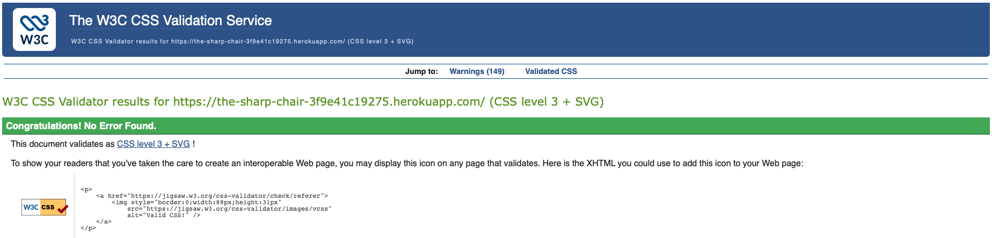

### 10.3 LightHouse performance Screenshots 

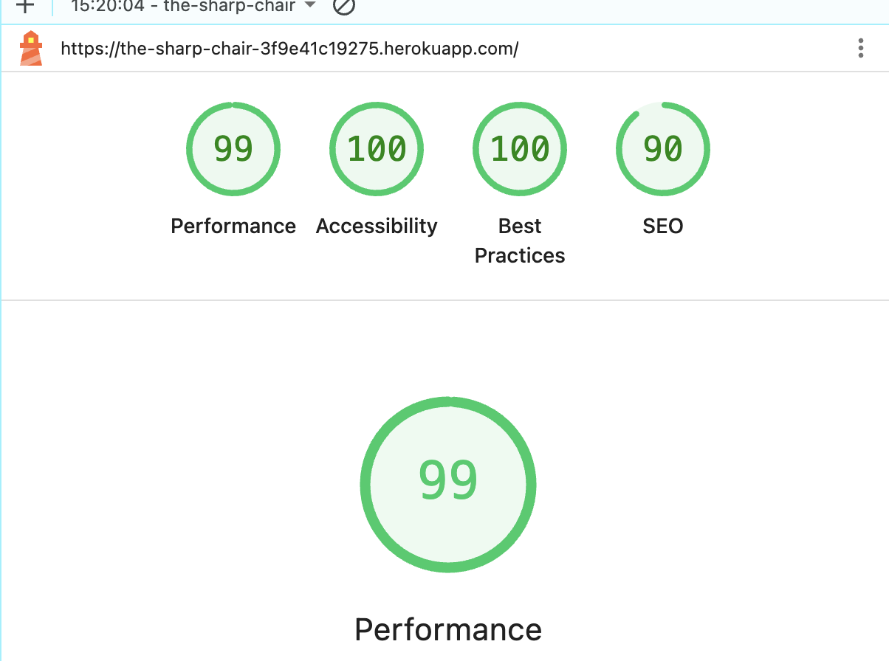
### 10.4 HTML Validation Screenshots
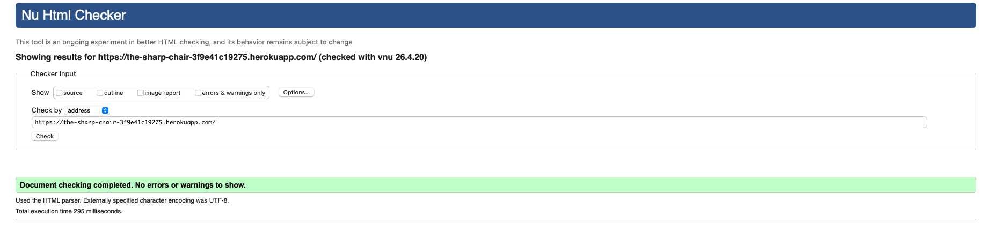

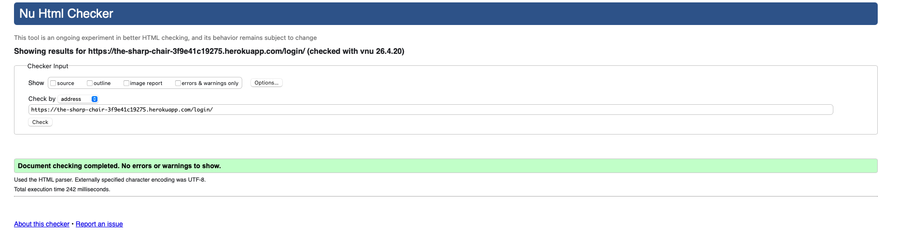
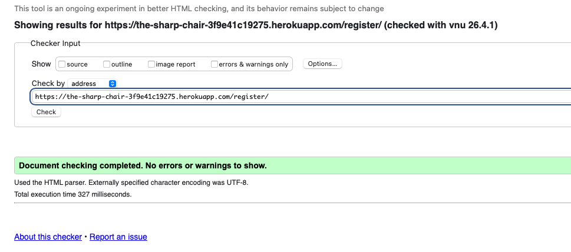
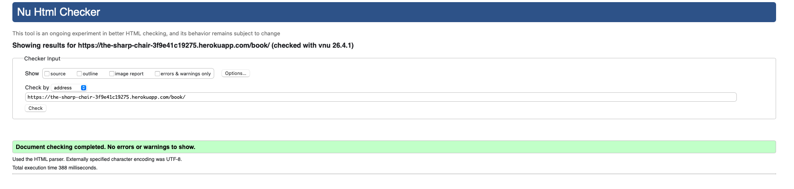


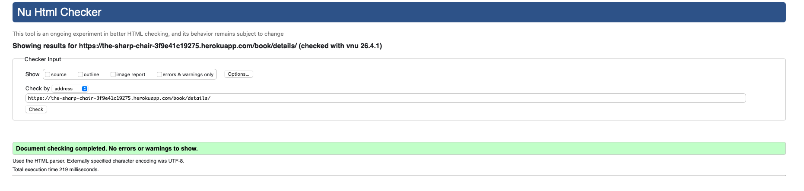
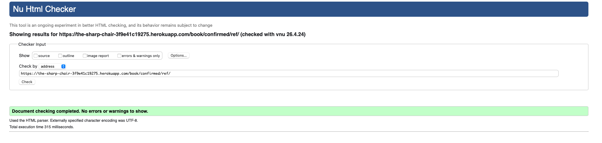
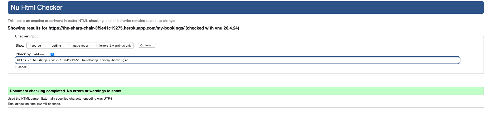
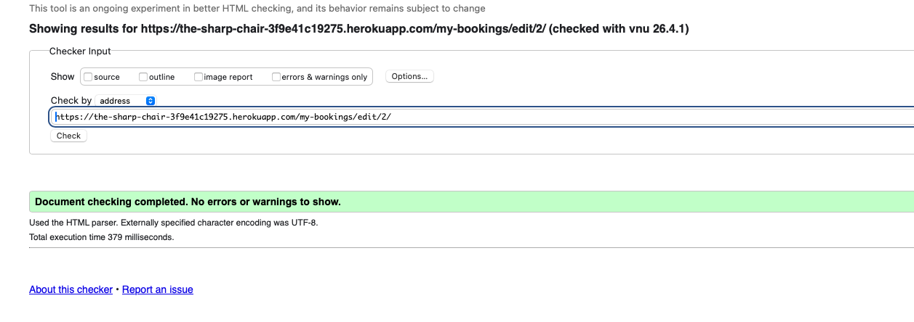
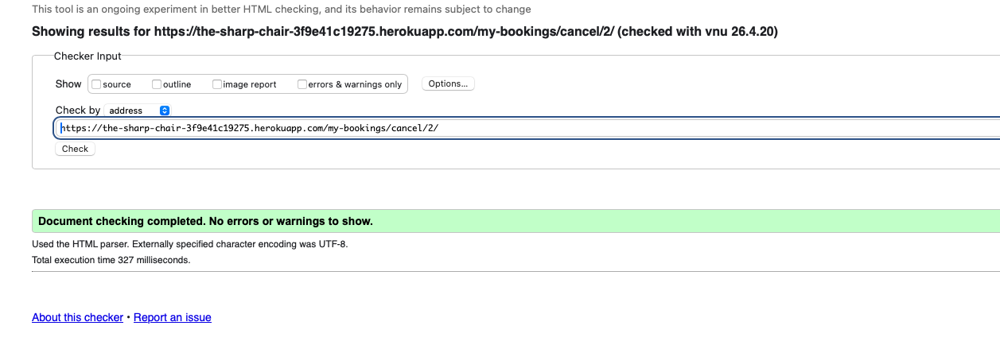


---

## 12. Bugs

### 12.1 Fixed Bugs

| Bug | Description | Fix | Screenshot |
|---|---|---|---|
| end_time cannot be null | `full_clean()` ran before `save()` had calculated `end_time`, causing a null constraint error on every booking submission. | Extracted `_calculate_end_time()` into its own method called at the start of `clean()` so `end_time` is populated before validation runs. Set `null=True, blank=True` on the field and ran a new migration. |  |
| TemplateSyntaxError duplicate block | HTML comments containing Django template tags such as `` caused Django to read them as real tags, creating duplicate block definitions. | Removed all Django template tag syntax from inside HTML comment blocks across all template files. |  |
| Horizontal overflow on mobile | Hero section, navigation and heading text were wider than the viewport on mobile, causing a horizontal scrollbar and right-side content being cut off. | Added `overflow-x: hidden` and `max-width: 100%` to both `html` and `body`. Added `overflow: hidden` to all major containers. |  |
| Nav logo wrapping on mobile | THE SHARP CHAIR logo was wrapping onto multiple lines on small screens. | Added `white-space: nowrap` and `flex-shrink: 0` to `.nav-logo`. Added `flex-shrink: 1` and `overflow: hidden` to `.nav-links`. |  |
| Book Now button cut off in nav on mobile | The Book Now CTA button was being pushed off screen on small devices — only a thin gold sliver was visible on the right edge of the navigation. | Set `display: none !important` on `.nav-cta` inside the `@media (max-width: 600px)` block. The button is hidden on mobile since the home page and services page both provide prominent Book Appointment buttons. |  |
| Flash message overlapping step progress indicator | Django flash messages used `position: fixed` which caused them to float over page content. On the booking wizard, the welcome message covered step bubble 1, obscuring the step indicator. | Changed `.messages-container` to `position: static` inside the mobile media query so messages sit in the normal page flow and push content down rather than overlapping it. |  |
| Sign Out showing empty brackets in nav | The nav displayed `SIGN OUT ()` when a user account had no first name set — `{{ user.first_name }}` rendered as an empty string. | Added the `\|default:user.username` filter: `{{ user.first_name\|default:user.username }}` so the username is shown as a fallback when first name is empty. |  |
| psycopg2-binary build error on Heroku | `psycopg2-binary==2.9.9` was incompatible with Python 3.13 on Heroku causing deployment failure. | Upgraded to `psycopg2-binary==2.9.10` in requirements.txt. |  |
| runtime.txt deprecated | Heroku deprecated `runtime.txt` in favour of `.python-version`, showing a warning on every build. | Deleted `runtime.txt` and created `.python-version` containing `3.13`. |  |
| Git push rejected divergent histories | GitHub was initialised with a README while the local repo was initialised separately causing divergent histories. | Ran `git pull origin main --allow-unrelated-histories` with `git config pull.rebase false` to merge before pushing. |  |

### 12.2 Known Remaining Issues

| Issue | Description | Status |
|---|---|---|
| Expert Barbers shows 0 on home | Stat shows 0 until barber accounts are created via admin panel on Heroku. | Expected behaviour — requires admin setup after deployment. |
| Barber redirected to My Bookings on login | When a barber account logs in, Django's `LOGIN_REDIRECT_URL` in `settings.py` is set to `/my-bookings/` which is the customer dashboard. Barbers are redirected there instead of `/schedule/`. The barber can manually navigate to My Schedule via the navigation link. A future fix would add a custom login view that checks `hasattr(user, 'barber')` after authentication and redirects to the appropriate dashboard based on role. | Known issue — navigation link available as workaround |
| Barbers can access the booking wizard | Barber accounts are not blocked from completing a booking as a customer. There is no restriction preventing a logged-in barber from navigating to `/book/` and creating an appointment. A future fix would add a check in `book_step1()` that redirects barbers away from the wizard. | Known issue — low priority as barbers would only be booking for themselves |
| Phone number and email not validated against real format | The phone field on the registration form accepts any string including letters and invalid formats. The email field checks for duplicate accounts but does not validate against a real email server to confirm the address exists and is reachable. A future fix would add a `RegexValidator` to the phone field to enforce a UK phone number format, and email verification on registration using a package such as django-allauth. | Known issue — basic format check present, server-side verification not implemented |

---

## 13. Deployment

### 13.1 Local Development Setup

**Requirements:** Python 3.12 or 3.13, Git, VS Code.

**Clone the project:**

```bash
git clone https://github.com/yavorgeorgiev2004/TheSharpChair.git
cd TheSharpChair
```

**Create and activate virtual environment:**

```bash
python3 -m venv .venv
source .venv/bin/activate
```

**Install dependencies:**

```bash
pip install --upgrade pip
pip install -r requirements.txt
```

**Create the .env file:**

```bash
cp .env.example .env
```

Generate a secret key:

```bash
python -c "from django.core.management.utils import get_random_secret_key; print(get_random_secret_key())"
```

Open `.env` and set:

```
SECRET_KEY=your-generated-key-here
DEBUG=True
DATABASE_URL=sqlite:///db.sqlite3
```

> **Important — DEBUG must be True for local development.** The codebase has `default=False` for production safety, which means without `DEBUG=True` in your `.env` file, Django will not serve static files through the development server and error pages will be suppressed. Always set `DEBUG=True` in your local `.env` file. Never commit the `.env` file to version control.

**Set up the database:**

```bash
python manage.py makemigrations
python manage.py migrate
python manage.py loaddata initial_data
python manage.py createsuperuser
```

**Run the development server:**

```bash
python manage.py runserver
```

Visit `http://127.0.0.1:8000`.

---

### 13.2 Heroku Deployment

**Requirements:** Heroku account, Heroku CLI (`brew install heroku`), GitHub repository with code pushed.

**Step 1 — Create the Heroku app**

In the Heroku dashboard at [https://dashboard.heroku.com](https://dashboard.heroku.com):

- Click **New → Create new app**
- Choose a unique name
- Region: **Europe**
- Click **Create app**

**Step 2 — Add PostgreSQL**

On the app page click **Resources**:

- Search add-ons for `postgres`
- Select **Heroku Postgres — Essential-0**
- Click **Submit Order Form**

Heroku sets `DATABASE_URL` automatically.

**Step 3 — Set environment variables**

Click **Settings → Reveal Config Vars**. Add:

| Key | Value |
|---|---|
| `SECRET_KEY` | Your generated secret key |
| `DEBUG` | `False` |

**Step 4 — Connect GitHub and deploy**

Click **Deploy**:

- Select **GitHub** as deployment method
- Connect to GitHub and authorise
- Search for and connect the repository
- Under Manual deploy, select **main** branch
- Click **Deploy Branch**

**Step 5 — Set up Heroku database**

```bash
heroku login
heroku run python manage.py migrate --app your-app-name
heroku run python manage.py loaddata initial_data --app your-app-name
heroku run python manage.py createsuperuser --app your-app-name
```

**Step 6 — Open the app**

```bash
heroku open --app your-app-name
```

**Step 7 — Create barber accounts**

Go to `/admin` on the live site and log in as the superuser:

1. **Users → Add User** — enter username, password, first name, last name, email. Save.
2. **Barbers → Add Barber** — select the user, enter speciality, tick **is_available**. Save.

The barber can now log in at `/login` and will see **My Schedule** in the navigation.

---

### 13.3 Updating the Live Site

```bash
git add file-you-changed
git commit -m "describe the change"
git push origin main
```

Then in the Heroku dashboard → Deploy tab → Deploy Branch.

If `models.py` changed:

```bash
heroku run python manage.py migrate --app your-app-name
```

---

## 14. How to Use the Application

### 14.1 Pre-created Accounts

The following accounts are available on the live Heroku deployment for assessment.

**Superuser / Admin**

| | |
|---|---|
| URL | `/admin/` |
| Username | `admin` |
| Password | `Admin1234!` |

Full access to all data in the Django admin panel. All bookings, users, services, barbers and cancellation records can be viewed and managed here.

**Test Customer**

| | |
|---|---|
| URL | `/login/` |
| Username | `customer` |
| Password | `Test1234!` |

A regular customer account. Use this to test the booking wizard, My Bookings, edit and cancel functionality.

**Test Barber**

| | |
|---|---|
| URL | `/login/` |
| Username | placeholder |
| Password | placeholder |

Log in as this account to view the barber schedule dashboard.

---

### 14.2 Customer Journey

1. Visit the live site and click **Register** or **Sign In**
2. Click **Book Now** from the navigation or home page
3. **Step 1** — Select a service from the cards and click Continue
4. **Step 2** — Select a barber and click Continue
5. **Step 3** — Select a date. Available time slots appear automatically. Click a slot.
6. **Step 4** — Confirm your personal details and click **Confirm & Book**
7. The confirmation page shows your unique booking reference number
8. Go to **My Bookings** to view, edit or cancel your appointment

### 14.3 Barber Journey

1. Log in with a barber account
2. The navigation shows **My Schedule** instead of My Bookings
3. All upcoming confirmed appointments are listed chronologically
4. Each card shows the customer name, email, service, and full time range
5. Use the Cancel button to cancel an appointment if needed

### 14.4 Admin Panel Guide

Navigate to `/admin/` and log in with the admin credentials.

| Section | Purpose |
|---|---|
| **Users** | View all accounts, create new users, grant staff status |
| **Bookings** | View all appointments, search by reference or email, filter by status or date, update status inline |
| **Services** | Add new services, edit prices and durations, deactivate services with `is_active=False` |
| **Barbers** | Create barber profiles linked to user accounts, toggle availability |
| **Cancellations** | View the full audit trail of all cancellations with who cancelled and why |
| **User Profiles** | View customer phone numbers |

---

## 15. Technologies Used

| Technology | Version | Purpose |
|---|---|---|
| Python | 3.13 | Core programming language |
| Django | 5.2.13 LTS | Web framework — routing, ORM, auth, templates, admin panel |
| PostgreSQL | latest | Production relational database on Heroku |
| SQLite | built-in | Local development database |
| psycopg2-binary | 2.9.10 | Django to PostgreSQL connector |
| gunicorn | 21.2.0 | Production WSGI server |
| whitenoise | 6.6.0 | Static file serving in production |
| dj-database-url | 2.1.0 | Parses DATABASE_URL environment variable |
| python-decouple | 3.8 | Reads environment variables from .env file |
| HTML5 | — | Frontend page structure |
| CSS3 | — | Custom styling with CSS variables and media queries |
| JavaScript ES6 | — | AJAX slot fetching and card selection UI |
| Git | — | Version control |
| GitHub | — | Remote repository |
| Heroku | — | Cloud deployment platform |

---

## 16. Credits and Attributions

### 16.1 Python Language

| Topic | What it was used for | Documentation |
|---|---|---|
| Python 3.13 | Core programming language for all backend logic | [https://docs.python.org/3/](https://docs.python.org/3/) |
| `datetime` module | `datetime.combine()` merges date and time objects for timedelta arithmetic in slot generation | [https://docs.python.org/3/library/datetime.html](https://docs.python.org/3/library/datetime.html) |
| `timedelta` | Represents a fixed duration — used to step through 30-minute windows and calculate end_time | [https://docs.python.org/3/library/datetime.html#timedelta-objects](https://docs.python.org/3/library/datetime.html#timedelta-objects) |
| `uuid` module | `uuid.uuid4().hex[:8].upper()` generates the unique booking reference suffix | [https://docs.python.org/3/library/uuid.html](https://docs.python.org/3/library/uuid.html) |
| `date.weekday()` | Returns 0–6 for Monday–Sunday. Used to reject weekend bookings (`weekday() >= 5`) | [https://docs.python.org/3/library/datetime.html#datetime.date.weekday](https://docs.python.org/3/library/datetime.html#datetime.date.weekday) |
| `date.fromisoformat()` | Converts ISO date string from form input into a Python date object | [https://docs.python.org/3/library/datetime.html#datetime.date.fromisoformat](https://docs.python.org/3/library/datetime.html#datetime.date.fromisoformat) |
| `strftime()` | Formats time objects as strings for JSON serialisation in the AJAX endpoint | [https://docs.python.org/3/library/datetime.html#strftime-and-strptime-format-codes](https://docs.python.org/3/library/datetime.html#strftime-and-strptime-format-codes) |
| List comprehension | `[s.strftime('%H:%M') for s in slots]` — compact list building used in the AJAX view | [https://docs.python.org/3/tutorial/datastructures.html#list-comprehensions](https://docs.python.org/3/tutorial/datastructures.html#list-comprehensions) |
| f-strings | `f"#{self.ref} — {self.customer}"` — string interpolation in model `__str__` methods | [https://docs.python.org/3/reference/lexical_analysis.html#f-strings](https://docs.python.org/3/reference/lexical_analysis.html#f-strings) |
| `hasattr()` | `hasattr(request.user, 'barber')` — role detection without a separate roles table | [https://docs.python.org/3/library/functions.html#hasattr](https://docs.python.org/3/library/functions.html#hasattr) |
| `getattr()` | `getattr(request.user, 'profile', None)` — safely accesses attributes that may not exist | [https://docs.python.org/3/library/functions.html#getattr](https://docs.python.org/3/library/functions.html#getattr) |

---

### 16.2 Django Framework

| Topic | What it was used for | Documentation |
|---|---|---|
| Django 5.2 LTS overview | Core web framework providing routing, ORM, auth, templates and admin | [https://docs.djangoproject.com/en/5.2/](https://docs.djangoproject.com/en/5.2/) |
| MVT architecture | The Model-View-Template pattern that structures the entire application | [https://docs.djangoproject.com/en/5.2/faq/general/#django-appears-to-be-a-mvc-framework-but-you-call-the-controller-the-view](https://docs.djangoproject.com/en/5.2/faq/general/) |
| `models.Model` | Base class for all database models — provides ORM integration | [https://docs.djangoproject.com/en/5.2/topics/db/models/](https://docs.djangoproject.com/en/5.2/topics/db/models/) |
| `OneToOneField` | Adds a UNIQUE constraint FK — used for UserProfile and Barber linked to auth_user | [https://docs.djangoproject.com/en/5.2/ref/models/fields/#onetoonefield](https://docs.djangoproject.com/en/5.2/ref/models/fields/#onetoonefield) |
| `ForeignKey` | Creates foreign key relationships between Booking and customer, barber, service | [https://docs.djangoproject.com/en/5.2/ref/models/fields/#foreignkey](https://docs.djangoproject.com/en/5.2/ref/models/fields/#foreignkey) |
| `on_delete=CASCADE` | Deletes child records when parent is deleted | [https://docs.djangoproject.com/en/5.2/ref/models/fields/#django.db.models.CASCADE](https://docs.djangoproject.com/en/5.2/ref/models/fields/#django.db.models.CASCADE) |
| `on_delete=PROTECT` | Blocks deletion of a parent record if children reference it | [https://docs.djangoproject.com/en/5.2/ref/models/fields/#django.db.models.PROTECT](https://docs.djangoproject.com/en/5.2/ref/models/fields/#django.db.models.PROTECT) |
| `on_delete=SET_NULL` | Sets FK to null when parent deleted — preserves cancellation audit records | [https://docs.djangoproject.com/en/5.2/ref/models/fields/#django.db.models.SET_NULL](https://docs.djangoproject.com/en/5.2/ref/models/fields/#django.db.models.SET_NULL) |
| `UniqueConstraint` | Database-level constraint preventing double booking on (barber, date, start_time) | [https://docs.djangoproject.com/en/5.2/ref/models/constraints/#uniqueconstraint](https://docs.djangoproject.com/en/5.2/ref/models/constraints/#uniqueconstraint) |
| `auto_now_add` | Sets timestamp field to now on INSERT only — used on created_at and cancelled_at | [https://docs.djangoproject.com/en/5.2/ref/models/fields/#django.db.models.DateTimeField.auto_now_add](https://docs.djangoproject.com/en/5.2/ref/models/fields/#django.db.models.DateTimeField.auto_now_add) |
| `auto_now` | Updates timestamp on every save — used on updated_at | [https://docs.djangoproject.com/en/5.2/ref/models/fields/#django.db.models.DateTimeField.auto_now](https://docs.djangoproject.com/en/5.2/ref/models/fields/#django.db.models.DateTimeField.auto_now) |
| `model.clean()` | Custom validation method called by full_clean() before database write | [https://docs.djangoproject.com/en/5.2/ref/models/instances/#django.db.models.Model.clean](https://docs.djangoproject.com/en/5.2/ref/models/instances/#django.db.models.Model.clean) |
| `model.save()` | Overridden to auto-generate booking reference and calculate end_time | [https://docs.djangoproject.com/en/5.2/ref/models/instances/#django.db.models.Model.save](https://docs.djangoproject.com/en/5.2/ref/models/instances/#django.db.models.Model.save) |
| `full_clean()` | Manually called in views to run field validation, clean() and validate_unique() | [https://docs.djangoproject.com/en/5.2/ref/models/instances/#django.db.models.Model.full_clean](https://docs.djangoproject.com/en/5.2/ref/models/instances/#django.db.models.Model.full_clean) |
| QuerySet API | `.filter()`, `.exclude()`, `.exists()`, `.select_related()`, `.order_by()` | [https://docs.djangoproject.com/en/5.2/ref/models/querysets/](https://docs.djangoproject.com/en/5.2/ref/models/querysets/) |
| `select_related()` | Fetches related objects in a single SQL JOIN — prevents N+1 query problem | [https://docs.djangoproject.com/en/5.2/ref/models/querysets/#select-related](https://docs.djangoproject.com/en/5.2/ref/models/querysets/#select-related) |
| `.exists()` | Returns True/False without fetching full objects — used for conflict detection | [https://docs.djangoproject.com/en/5.2/ref/models/querysets/#exists](https://docs.djangoproject.com/en/5.2/ref/models/querysets/#exists) |
| `status__in=[...]` | ORM field lookup equivalent to SQL WHERE status IN (...) | [https://docs.djangoproject.com/en/5.2/ref/models/querysets/#in](https://docs.djangoproject.com/en/5.2/ref/models/querysets/#in) |
| `get_object_or_404` | Fetches object or returns 404 — used for permission checks in views | [https://docs.djangoproject.com/en/5.2/topics/http/shortcuts/#get-object-or-404](https://docs.djangoproject.com/en/5.2/topics/http/shortcuts/#get-object-or-404) |
| `render()` | Renders a template with context and returns HttpResponse | [https://docs.djangoproject.com/en/5.2/topics/http/shortcuts/#render](https://docs.djangoproject.com/en/5.2/topics/http/shortcuts/#render) |
| `redirect()` | Returns HTTP 302 redirect to a named URL | [https://docs.djangoproject.com/en/5.2/topics/http/shortcuts/#redirect](https://docs.djangoproject.com/en/5.2/topics/http/shortcuts/#redirect) |
| `JsonResponse` | Returns JSON HTTP response — used by the AJAX slots endpoint | [https://docs.djangoproject.com/en/5.2/ref/request-response/#jsonresponse-objects](https://docs.djangoproject.com/en/5.2/ref/request-response/#jsonresponse-objects) |
| `@login_required` | Decorator redirecting unauthenticated users to LOGIN_URL | [https://docs.djangoproject.com/en/5.2/topics/auth/default/#the-login-required-decorator](https://docs.djangoproject.com/en/5.2/topics/auth/default/#the-login-required-decorator) |
| `@require_GET` | Decorator returning 405 if endpoint called with non-GET method | [https://docs.djangoproject.com/en/5.2/topics/http/decorators/#django.views.decorators.http.require_http_methods](https://docs.djangoproject.com/en/5.2/topics/http/decorators/#django.views.decorators.http.require_http_methods) |
| Session framework | `request.session` — server-side key-value storage across HTTP requests | [https://docs.djangoproject.com/en/5.2/topics/http/sessions/](https://docs.djangoproject.com/en/5.2/topics/http/sessions/) |
| Messages framework | `messages.success()` — one-time flash notifications stored in session | [https://docs.djangoproject.com/en/5.2/ref/contrib/messages/](https://docs.djangoproject.com/en/5.2/ref/contrib/messages/) |
| `forms.Form` | Generic form class not tied to a model — used for wizard steps and cancellation | [https://docs.djangoproject.com/en/5.2/topics/forms/](https://docs.djangoproject.com/en/5.2/topics/forms/) |
| `forms.ModelForm` | Form tied directly to a model — used for EditBookingForm | [https://docs.djangoproject.com/en/5.2/topics/forms/modelforms/](https://docs.djangoproject.com/en/5.2/topics/forms/modelforms/) |
| `UserCreationForm` | Django built-in form extended by RegisterForm to add email, phone and name | [https://docs.djangoproject.com/en/5.2/topics/auth/default/#django.contrib.auth.forms.UserCreationForm](https://docs.djangoproject.com/en/5.2/topics/auth/default/#django.contrib.auth.forms.UserCreationForm) |
| `AuthenticationForm` | Django built-in login form — handles password hash verification | [https://docs.djangoproject.com/en/5.2/topics/auth/default/#django.contrib.auth.forms.AuthenticationForm](https://docs.djangoproject.com/en/5.2/topics/auth/default/#django.contrib.auth.forms.AuthenticationForm) |
| `ValidationError` | Raised in clean() methods to reject invalid form data | [https://docs.djangoproject.com/en/5.2/ref/exceptions/#django.core.exceptions.ValidationError](https://docs.djangoproject.com/en/5.2/ref/exceptions/#django.core.exceptions.ValidationError) |
| `form.save(commit=False)` | Builds object in memory without database write — allows additional field setting before INSERT | [https://docs.djangoproject.com/en/5.2/topics/forms/modelforms/#the-save-method](https://docs.djangoproject.com/en/5.2/topics/forms/modelforms/#the-save-method) |
| `login()` / `logout()` | Creates and destroys user sessions — used in auth views | [https://docs.djangoproject.com/en/5.2/topics/auth/default/#how-to-log-a-user-in](https://docs.djangoproject.com/en/5.2/topics/auth/default/#how-to-log-a-user-in) |
| URL routing | `path()` and `include()` — maps URLs to view functions by name | [https://docs.djangoproject.com/en/5.2/topics/http/urls/](https://docs.djangoproject.com/en/5.2/topics/http/urls/) |
| URL namespacing | `name=` parameter on `path()` — allows `` and `redirect('name')` | [https://docs.djangoproject.com/en/5.2/topics/http/urls/#naming-url-patterns](https://docs.djangoproject.com/en/5.2/topics/http/urls/#naming-url-patterns) |
| Django admin | `@admin.register()` — auto-generates management interface from model definitions | [https://docs.djangoproject.com/en/5.2/ref/contrib/admin/](https://docs.djangoproject.com/en/5.2/ref/contrib/admin/) |
| `list_display` | Controls which columns appear in the admin changelist view | [https://docs.djangoproject.com/en/5.2/ref/contrib/admin/#django.contrib.admin.ModelAdmin.list_display](https://docs.djangoproject.com/en/5.2/ref/contrib/admin/#django.contrib.admin.ModelAdmin.list_display) |
| `list_editable` | Allows inline editing of fields directly in the changelist | [https://docs.djangoproject.com/en/5.2/ref/contrib/admin/#django.contrib.admin.ModelAdmin.list_editable](https://docs.djangoproject.com/en/5.2/ref/contrib/admin/#django.contrib.admin.ModelAdmin.list_editable) |
| `search_fields` with `__` | Traverses FK relationships in admin search — `customer__email` searches related User | [https://docs.djangoproject.com/en/5.2/ref/contrib/admin/#django.contrib.admin.ModelAdmin.search_fields](https://docs.djangoproject.com/en/5.2/ref/contrib/admin/#django.contrib.admin.ModelAdmin.search_fields) |
| Template inheritance | `` and `` — base.html inherited by all 13 child templates | [https://docs.djangoproject.com/en/5.2/ref/templates/language/#template-inheritance](https://docs.djangoproject.com/en/5.2/ref/templates/language/#template-inheritance) |
| Template include | `` with `with` — used for the step_progress.html partial | [https://docs.djangoproject.com/en/5.2/ref/templates/builtins/#include](https://docs.djangoproject.com/en/5.2/ref/templates/builtins/#include) |
| Template filters | `\|date`, `\|time`, `\|default`, `\|floatformat` — transform values for display | [https://docs.djangoproject.com/en/5.2/ref/templates/builtins/#built-in-filter-reference](https://docs.djangoproject.com/en/5.2/ref/templates/builtins/#built-in-filter-reference) |
| `` | Loads the static files template tag library | [https://docs.djangoproject.com/en/5.2/ref/templates/builtins/#load](https://docs.djangoproject.com/en/5.2/ref/templates/builtins/#load) |
| `` | Injects CSRF token into POST forms — validated by CsrfViewMiddleware | [https://docs.djangoproject.com/en/5.2/ref/csrf/](https://docs.djangoproject.com/en/5.2/ref/csrf/) |
| `CsrfViewMiddleware` | Validates CSRF token on every POST request | [https://docs.djangoproject.com/en/5.2/ref/middleware/#django.middleware.csrf.CsrfViewMiddleware](https://docs.djangoproject.com/en/5.2/ref/middleware/#django.middleware.csrf.CsrfViewMiddleware) |
| Migrations | `makemigrations` and `migrate` — translates model changes to SQL | [https://docs.djangoproject.com/en/5.2/topics/migrations/](https://docs.djangoproject.com/en/5.2/topics/migrations/) |
| Fixtures | `loaddata` — loads initial service data from JSON file | [https://docs.djangoproject.com/en/5.2/howto/initial-data/](https://docs.djangoproject.com/en/5.2/howto/initial-data/) |
| `AUTH_PASSWORD_VALIDATORS` | Enforces password strength requirements on registration | [https://docs.djangoproject.com/en/5.2/topics/auth/passwords/#enabling-password-validation](https://docs.djangoproject.com/en/5.2/topics/auth/passwords/#enabling-password-validation) |
| `MESSAGE_TAGS` | Maps message levels to CSS class names in settings.py | [https://docs.djangoproject.com/en/5.2/ref/contrib/messages/#message-tags](https://docs.djangoproject.com/en/5.2/ref/contrib/messages/#message-tags) |
| `LOGIN_URL` | Specifies where `@login_required` redirects unauthenticated users | [https://docs.djangoproject.com/en/5.2/ref/settings/#login-url](https://docs.djangoproject.com/en/5.2/ref/settings/#login-url) |
| `ALLOWED_HOSTS` | Restricts which domains Django responds to — prevents host header injection | [https://docs.djangoproject.com/en/5.2/ref/settings/#allowed-hosts](https://docs.djangoproject.com/en/5.2/ref/settings/#allowed-hosts) |
| `STATICFILES_STORAGE` | Configures whitenoise to compress and hash static files for production | [https://docs.djangoproject.com/en/5.2/ref/settings/#staticfiles-storage](https://docs.djangoproject.com/en/5.2/ref/settings/#staticfiles-storage) |
| `get_full_name()` | Returns "First Last" from a User object — used in admin and templates | [https://docs.djangoproject.com/en/5.2/ref/contrib/auth/#django.contrib.auth.models.User.get_full_name](https://docs.djangoproject.com/en/5.2/ref/contrib/auth/#django.contrib.auth.models.User.get_full_name) |
| `get_status_display()` | Returns the human-readable label for a choices field value | [https://docs.djangoproject.com/en/5.2/ref/models/instances/#django.db.models.Model.get_FOO_display](https://docs.djangoproject.com/en/5.2/ref/models/instances/#django.db.models.Model.get_FOO_display) |
| `request.resolver_match.url_name` | Gets the name of the currently matched URL — used for active nav link highlighting | [https://docs.djangoproject.com/en/5.2/ref/request-response/#django.http.HttpRequest.resolver_match](https://docs.djangoproject.com/en/5.2/ref/request-response/#django.http.HttpRequest.resolver_match) |

---

### 16.2a Key Django Techniques — In Depth

The following section explains the larger techniques and patterns used in the project, why they were chosen, where the approach was inspired by or referenced from, and how the code was assembled to produce the final result.

---

#### The Four-Step Booking Wizard and Session State

The booking wizard was inspired by the common multi-step form pattern described in the Django documentation on sessions. HTTP is stateless — each request is independent. To carry data across four separate page loads, `request.session` was used. The session stores data server-side in the `django_session` database table. The browser only holds a session key cookie, meaning no booking data is ever exposed to the client.

The guard pattern on each step — checking `if 'booking_service' not in request.session` and redirecting backwards — was derived from Django's own recommended session usage patterns. This prevents users from jumping to step 4 via a direct URL without completing earlier steps.

Reference: [https://docs.djangoproject.com/en/5.2/topics/http/sessions/](https://docs.djangoproject.com/en/5.2/topics/http/sessions/)

---

#### The Slot Generation Algorithm — Interval Overlap

The `get_available_slots()` function uses a while loop stepping through every 30-minute window from 8am to 8pm. The core technique — the interval overlap check — comes from a well-known algorithm in computer science and database design. Two time ranges overlap if and only if one starts before the other ends AND ends after the other starts:

```
A overlaps B  if  A.start < B.end  AND  A.end > B.start
```

Applied to the ORM: `start_time__lt=slot_end AND end_time__gt=slot_start`. This was adapted from the PostgreSQL range overlap documentation and the Django ORM field lookup reference. The query is executed once before the loop and reused, avoiding the N+1 problem described in the Django documentation on QuerySet evaluation.

Reference: [https://docs.djangoproject.com/en/5.2/ref/models/querysets/#field-lookups](https://docs.djangoproject.com/en/5.2/ref/models/querysets/#field-lookups)
Reference: [https://wiki.postgresql.org/wiki/Range_aggregation](https://wiki.postgresql.org/wiki/Range_aggregation)

---

#### The AJAX Internal API and JsonResponse

The `/ajax/slots/` endpoint is a Django view that returns `JsonResponse` instead of a rendered template. This pattern — a Django view serving JSON to JavaScript — is described in the Django documentation on JsonResponse and is a standard technique for adding dynamic behaviour to server-rendered applications without adopting a full frontend framework.

The JavaScript `fetch()` call on the client side was written using the MDN Fetch API guide as reference. The URL is built with a template literal injecting Django context variables (`{{ barber.id }}`, `{{ service.id }}`) that were rendered into the page by the view. This is the standard technique for passing server-side data to JavaScript in Django without a REST framework.

Reference: [https://docs.djangoproject.com/en/5.2/ref/request-response/#jsonresponse-objects](https://docs.djangoproject.com/en/5.2/ref/request-response/#jsonresponse-objects)
Reference: [https://developer.mozilla.org/en-US/docs/Web/API/Fetch_API/Using_Fetch](https://developer.mozilla.org/en-US/docs/Web/API/Fetch_API/Using_Fetch)

---

#### The ORM and Database Querying

All database interaction uses Django's ORM. No raw SQL is written anywhere in the project. The ORM translates Python method calls into parameterised SQL automatically, which also prevents SQL injection by design.

`Booking.objects.filter(customer=request.user)` generates `SELECT * FROM bookings_booking WHERE customer_id = ?`. The `?` is a parameterised placeholder — the value is never interpolated directly into the SQL string.

`select_related('barber__user', 'service')` was used on the My Bookings and Barber Schedule views after identifying the N+1 query problem. Without it, accessing `booking.barber.user.first_name` inside a template loop makes one extra SQL query per booking. With it, a single SQL JOIN fetches all related data at once. The double underscore notation traverses the `barber` ForeignKey and then the `user` OneToOneField in a single expression.

Reference: [https://docs.djangoproject.com/en/5.2/ref/models/querysets/#select-related](https://docs.djangoproject.com/en/5.2/ref/models/querysets/#select-related)
Reference: [https://docs.djangoproject.com/en/5.2/topics/db/optimization/](https://docs.djangoproject.com/en/5.2/topics/db/optimization/)

---

#### Extending Django's Built-in User Model

Rather than replacing `auth_user` with a custom model, the project uses the profile extension pattern recommended in the Django documentation for adding fields to the built-in User. A `UserProfile` model with a `OneToOneField` to `User` stores additional customer data. A `Barber` model with a `OneToOneField` stores barber-specific data.

This approach is simpler and safer than substituting `AUTH_USER_MODEL`. It preserves full compatibility with Django's built-in authentication, admin, and permission systems. The pattern of creating the profile inside `RegisterForm.save()` immediately after `user.save()` was taken directly from the Django documentation example for extending the user model.

Reference: [https://docs.djangoproject.com/en/5.2/topics/auth/customizing/#extending-the-existing-user-model](https://docs.djangoproject.com/en/5.2/topics/auth/customizing/#extending-the-existing-user-model)

---

#### The Decorator Pattern for Authentication

`@login_required` is a higher-order function — a function that wraps another function and adds behaviour before it executes. This is the Decorator design pattern applied in Python. Rather than writing an authentication check at the start of every view, the decorator applies it declaratively in a single line. This is the DRY (Don't Repeat Yourself) principle in practice.

`@require_GET` on the AJAX endpoint is a similar decorator that returns HTTP 405 Method Not Allowed if the endpoint is called with POST or any other method. This was used instead of checking `request.method` manually inside the view body.

Reference: [https://docs.djangoproject.com/en/5.2/topics/auth/default/#the-login-required-decorator](https://docs.djangoproject.com/en/5.2/topics/auth/default/#the-login-required-decorator)
Reference: [https://realpython.com/primer-on-python-decorators/](https://realpython.com/primer-on-python-decorators/)

---

#### The clean() and full_clean() Validation Pipeline

Django's validation pipeline is documented in the model validation reference. The standard flow is `clean_fields()` → `clean()` → `validate_unique()`. The project calls `full_clean()` explicitly inside `book_step4()` before `save()`, because Django does not call `full_clean()` automatically on `model.save()` — this is a documented behaviour that catches many developers off guard.

The decision to call `_calculate_end_time()` at the start of `clean()` before validation runs was derived from understanding this pipeline. `validate_unique()` checks the `UniqueConstraint` on the booking table and would fail if `end_time` were null. By calculating it first inside `clean()`, the field is populated before any constraint checking occurs.

Reference: [https://docs.djangoproject.com/en/5.2/ref/models/instances/#validating-objects](https://docs.djangoproject.com/en/5.2/ref/models/instances/#validating-objects)

---

#### settings.py — Configuration Patterns and Sources

The settings file structure follows the Twelve-Factor App methodology for environment-based configuration. Each setting and its source:

| Setting | Pattern Source |
|---|---|
| `SECRET_KEY = config('SECRET_KEY')` | python-decouple documentation — [https://github.com/HBNetwork/python-decouple](https://github.com/HBNetwork/python-decouple) |
| `DEBUG = config('DEBUG', default=True, cast=bool)` | python-decouple `cast=` parameter — converts string env var to Python bool |
| `DATABASES = {'default': dj_database_url.config(...)}` | dj-database-url documentation — [https://github.com/jazzband/dj-database-url](https://github.com/jazzband/dj-database-url) |
| `'whitenoise.middleware.WhiteNoiseMiddleware'` | whitenoise Django integration guide — must be second in MIDDLEWARE after SecurityMiddleware — [https://whitenoise.readthedocs.io/en/stable/django.html](https://whitenoise.readthedocs.io/en/stable/django.html) |
| `STATICFILES_STORAGE = 'whitenoise.storage.CompressedManifestStaticFilesStorage'` | whitenoise storage backend — adds content hash to filenames for cache busting — [https://whitenoise.readthedocs.io/en/stable/django.html#add-compression-and-caching-support](https://whitenoise.readthedocs.io/en/stable/django.html#add-compression-and-caching-support) |
| `TIME_ZONE = 'Europe/London'` | Django timezone settings — all datetimes stored UTC, displayed in London time — [https://docs.djangoproject.com/en/5.2/topics/i18n/timezones/](https://docs.djangoproject.com/en/5.2/topics/i18n/timezones/) |
| `MESSAGE_TAGS` | Django messages framework — maps level constants to CSS class strings — [https://docs.djangoproject.com/en/5.2/ref/contrib/messages/#message-tags](https://docs.djangoproject.com/en/5.2/ref/contrib/messages/#message-tags) |
| `LOGIN_URL`, `LOGIN_REDIRECT_URL`, `LOGOUT_REDIRECT_URL` | Django auth settings — control redirect behaviour for `@login_required` and login/logout views — [https://docs.djangoproject.com/en/5.2/ref/settings/#login-url](https://docs.djangoproject.com/en/5.2/ref/settings/#login-url) |
| `DEFAULT_AUTO_FIELD = 'BigAutoField'` | Django 3.2+ requirement — sets 64-bit integer as default PK type — [https://docs.djangoproject.com/en/5.2/ref/settings/#default-auto-field](https://docs.djangoproject.com/en/5.2/ref/settings/#default-auto-field) |

---

#### JSON Serialisation in the AJAX Endpoint

The AJAX endpoint returns time objects as formatted strings because JSON cannot serialise Python `time` objects natively. `s.strftime('%H:%M')` converts `time(9, 30, 0)` to the string `'09:30'`. The list comprehension `[s.strftime('%H:%M') for s in slots]` applies this to every slot in one line.

`JsonResponse({'slots': [...]})` wraps the list in a dictionary and sets the `Content-Type: application/json` header automatically. On the JavaScript side, `.then(r => r.json())` parses the response body string back into a JavaScript object. This round-trip — Python dict → JSON string → JavaScript object — is the standard web API data exchange pattern.

Reference: [https://docs.djangoproject.com/en/5.2/ref/request-response/#jsonresponse-objects](https://docs.djangoproject.com/en/5.2/ref/request-response/#jsonresponse-objects)
Reference: [https://developer.mozilla.org/en-US/docs/Learn/JavaScript/Objects/JSON](https://developer.mozilla.org/en-US/docs/Learn/JavaScript/Objects/JSON)

---

#### The Soft Delete and Audit Trail Pattern

Cancelling a booking sets `booking.status = 'cancelled'` and calls `booking.save()` rather than `booking.delete()`. This is the soft delete pattern — widely used in production systems where data must be preserved for auditing, analytics or dispute resolution. A separate `Cancellation` record is created simultaneously with `Cancellation.objects.create(booking=booking, cancelled_by=request.user, reason=...)`.

This pattern was inspired by the approach described in the Django documentation on model deletion and by common Django application design patterns where financial or transactional records are never permanently removed.

Reference: [https://docs.djangoproject.com/en/5.2/ref/models/instances/#django.db.models.Model.delete](https://docs.djangoproject.com/en/5.2/ref/models/instances/#django.db.models.Model.delete)

---

#### Role Detection Without a Roles Table

Rather than a separate roles or groups table, the application detects whether a user is a barber by checking `hasattr(request.user, 'barber')`. This works because `OneToOneField` with `related_name='barber'` adds a `.barber` attribute to the `User` object — but only if a linked `Barber` record exists. If the attribute does not exist, `hasattr()` returns `False` without raising an exception.

This technique is discussed in the Django documentation on reverse relations from OneToOneField and is a clean alternative to Django's built-in Groups and Permissions system for simple two-role applications.

Reference: [https://docs.djangoproject.com/en/5.2/ref/models/fields/#django.db.models.OneToOneField](https://docs.djangoproject.com/en/5.2/ref/models/fields/#django.db.models.OneToOneField)
Reference: [https://docs.djangoproject.com/en/5.2/topics/auth/default/#groups](https://docs.djangoproject.com/en/5.2/topics/auth/default/#groups)

---

### 16.3 Database and SQL

| Topic | What it was used for | Documentation |
|---|---|---|
| PostgreSQL | Production relational database on Heroku | [https://www.postgresql.org/docs/](https://www.postgresql.org/docs/) |
| Relational database design | Normalised schema with FKs — no data duplication across six tables | [https://www.postgresql.org/docs/current/ddl-constraints.html](https://www.postgresql.org/docs/current/ddl-constraints.html) |
| UNIQUE constraint | `UNIQUE(barber_id, date, start_time)` — database-level double booking prevention | [https://www.postgresql.org/docs/current/ddl-constraints.html#DDL-CONSTRAINTS-UNIQUE-CONSTRAINTS](https://www.postgresql.org/docs/current/ddl-constraints.html#DDL-CONSTRAINTS-UNIQUE-CONSTRAINTS) |
| Foreign key constraints | `REFERENCES` with `ON DELETE CASCADE / PROTECT / SET NULL` | [https://www.postgresql.org/docs/current/ddl-constraints.html#DDL-CONSTRAINTS-FK](https://www.postgresql.org/docs/current/ddl-constraints.html#DDL-CONSTRAINTS-FK) |
| SQL JOIN | Used implicitly by Django's `select_related()` to avoid N+1 queries | [https://www.postgresql.org/docs/current/queries-table-expressions.html](https://www.postgresql.org/docs/current/queries-table-expressions.html) |
| Interval overlap algorithm | `start__lt=end AND end__gt=start` — detects overlapping time ranges | [https://wiki.postgresql.org/wiki/Range_aggregation](https://wiki.postgresql.org/wiki/Range_aggregation) |
| SQLite | Local development database — zero setup, file-based | [https://www.sqlite.org/docs.html](https://www.sqlite.org/docs.html) |
| PBKDF2 password hashing | Django's default — SHA256 with 480,000 iterations in Django 5.2 | [https://docs.djangoproject.com/en/5.2/topics/auth/passwords/](https://docs.djangoproject.com/en/5.2/topics/auth/passwords/) |

---

### 16.4 Python Packages

| Package | Version | What it does | Documentation |
|---|---|---|---|
| psycopg2-binary | 2.9.10 | Database adapter connecting Django's ORM to PostgreSQL. The binary variant includes pre-compiled C extensions requiring no local PostgreSQL installation. | [https://www.psycopg.org/docs/](https://www.psycopg.org/docs/) |
| gunicorn | 21.2.0 | WSGI HTTP server running the Django application on Heroku. Handles multiple concurrent worker processes unlike Django's single-threaded development server. | [https://gunicorn.org/](https://gunicorn.org/) |
| whitenoise | 6.6.0 | Serves static files (CSS, JS) directly from Django in production without a separate web server. `CompressedManifestStaticFilesStorage` adds content hashes to filenames for cache busting. | [https://whitenoise.readthedocs.io/en/stable/](https://whitenoise.readthedocs.io/en/stable/) |
| dj-database-url | 2.1.0 | Parses the `DATABASE_URL` environment variable string into the dictionary format Django's `DATABASES` setting requires. Enables automatic SQLite/PostgreSQL switching. | [https://github.com/jazzband/dj-database-url](https://github.com/jazzband/dj-database-url) |
| python-decouple | 3.8 | Reads configuration from `.env` file locally and from environment variables in production. `config('KEY', default=value, cast=type)` handles type conversion automatically. | [https://github.com/HBNetwork/python-decouple](https://github.com/HBNetwork/python-decouple) |

---

### 16.5 JavaScript Techniques

| Technique | What it was used for | Documentation |
|---|---|---|
| `fetch()` API | Makes the AJAX request to `/ajax/slots/` when the user changes the date on step 3 | [https://developer.mozilla.org/en-US/docs/Web/API/Fetch_API/Using_Fetch](https://developer.mozilla.org/en-US/docs/Web/API/Fetch_API/Using_Fetch) |
| `.then()` chaining | Processes the fetch Promise — first parses JSON, then renders the slot buttons | [https://developer.mozilla.org/en-US/docs/Web/JavaScript/Reference/Global_Objects/Promise/then](https://developer.mozilla.org/en-US/docs/Web/JavaScript/Reference/Global_Objects/Promise/then) |
| `.catch()` | Handles network errors in the AJAX call without crashing the page | [https://developer.mozilla.org/en-US/docs/Web/JavaScript/Reference/Global_Objects/Promise/catch](https://developer.mozilla.org/en-US/docs/Web/JavaScript/Reference/Global_Objects/Promise/catch) |
| `Array.map()` | Transforms the slots array into HTML strings then joins them — used in slot rendering | [https://developer.mozilla.org/en-US/docs/Web/JavaScript/Reference/Global_Objects/Array/map](https://developer.mozilla.org/en-US/docs/Web/JavaScript/Reference/Global_Objects/Array/map) |
| `Array.join()` | Concatenates the mapped HTML string array into a single string for innerHTML | [https://developer.mozilla.org/en-US/docs/Web/JavaScript/Reference/Global_Objects/Array/join](https://developer.mozilla.org/en-US/docs/Web/JavaScript/Reference/Global_Objects/Array/join) |
| `document.querySelectorAll()` | Selects all service and barber pick cards for the click event listeners | [https://developer.mozilla.org/en-US/docs/Web/API/Document/querySelectorAll](https://developer.mozilla.org/en-US/docs/Web/API/Document/querySelectorAll) |
| `element.classList.add/remove()` | Adds and removes the `selected` CSS class on pick cards for visual feedback | [https://developer.mozilla.org/en-US/docs/Web/API/Element/classList](https://developer.mozilla.org/en-US/docs/Web/API/Element/classList) |
| `element.innerHTML` | Renders the AJAX slot buttons into the DOM without page reload | [https://developer.mozilla.org/en-US/docs/Web/API/Element/innerHTML](https://developer.mozilla.org/en-US/docs/Web/API/Element/innerHTML) |
| `addEventListener('click')` | Attaches click handler to pick cards — triggers card selection highlight | [https://developer.mozilla.org/en-US/docs/Web/API/EventTarget/addEventListener](https://developer.mozilla.org/en-US/docs/Web/API/EventTarget/addEventListener) |
| Template literals | `` `fetch('/ajax/slots/?barber_id=${BARBER_ID}')` `` — builds URL with injected variables | [https://developer.mozilla.org/en-US/docs/Web/JavaScript/Reference/Template_literals](https://developer.mozilla.org/en-US/docs/Web/JavaScript/Reference/Template_literals) |
| `setTimeout()` | Used for auto-dismissing flash messages after 4 seconds | [https://developer.mozilla.org/en-US/docs/Web/API/setTimeout](https://developer.mozilla.org/en-US/docs/Web/API/setTimeout) |
| Query string parameters | `?barber_id=1&service_id=2&date=2025-06-10` — passes data to AJAX endpoint via URL | [https://developer.mozilla.org/en-US/docs/Web/API/URL/searchParams](https://developer.mozilla.org/en-US/docs/Web/API/URL/searchParams) |

---

### 16.6 CSS Techniques

| Technique | What it was used for | Documentation |
|---|---|---|
| CSS custom properties | `--gold`, `--cream`, `--border` defined in `:root` — single source of truth for all colours | [https://developer.mozilla.org/en-US/docs/Web/CSS/Using_CSS_custom_properties](https://developer.mozilla.org/en-US/docs/Web/CSS/Using_CSS_custom_properties) |
| CSS Grid | `grid-template-columns: 1fr 1fr` — two-column hero and service card layouts | [https://developer.mozilla.org/en-US/docs/Web/CSS/CSS_grid_layout](https://developer.mozilla.org/en-US/docs/Web/CSS/CSS_grid_layout) |
| `auto-fill` grid | `repeat(auto-fill, minmax(260px, 1fr))` — responsive grid that creates as many columns as fit | [https://developer.mozilla.org/en-US/docs/Web/CSS/repeat](https://developer.mozilla.org/en-US/docs/Web/CSS/repeat) |
| CSS Flexbox | Navigation, buttons, booking cards — all use flexbox for alignment | [https://developer.mozilla.org/en-US/docs/Web/CSS/CSS_flexible_box_layout](https://developer.mozilla.org/en-US/docs/Web/CSS/CSS_flexible_box_layout) |
| `flex-shrink` | `flex-shrink: 0` on nav logo prevents it from being compressed — fixes mobile cutoff | [https://developer.mozilla.org/en-US/docs/Web/CSS/flex-shrink](https://developer.mozilla.org/en-US/docs/Web/CSS/flex-shrink) |
| `clamp()` | `font-size: clamp(3rem, 8vw, 7.5rem)` — responsive font that scales between a min and max | [https://developer.mozilla.org/en-US/docs/Web/CSS/clamp](https://developer.mozilla.org/en-US/docs/Web/CSS/clamp) |
| `@keyframes` | `fadeUp`, `poleSpin`, `popIn` — CSS animations for hero entrance and barber pole | [https://developer.mozilla.org/en-US/docs/Web/CSS/@keyframes](https://developer.mozilla.org/en-US/docs/Web/CSS/@keyframes) |
| `@media` queries | Three breakpoints at 900px, 600px and 400px for tablet, mobile and small phone | [https://developer.mozilla.org/en-US/docs/Web/CSS/@media](https://developer.mozilla.org/en-US/docs/Web/CSS/@media) |
| `overflow-x: hidden` | Applied to both `html` and `body` — prevents horizontal scroll from wide content | [https://developer.mozilla.org/en-US/docs/Web/CSS/overflow-x](https://developer.mozilla.org/en-US/docs/Web/CSS/overflow-x) |
| `position: sticky` | Keeps navigation bar fixed at the top of the viewport on scroll | [https://developer.mozilla.org/en-US/docs/Web/CSS/position](https://developer.mozilla.org/en-US/docs/Web/CSS/position) |
| `backdrop-filter: blur()` | Frosted glass effect on the navigation bar | [https://developer.mozilla.org/en-US/docs/Web/CSS/backdrop-filter](https://developer.mozilla.org/en-US/docs/Web/CSS/backdrop-filter) |
| `::before` pseudo-element | Gold decorative line before eyebrow text — created with CSS, no extra HTML element | [https://developer.mozilla.org/en-US/docs/Web/CSS/::before](https://developer.mozilla.org/en-US/docs/Web/CSS/::before) |
| `::after` pseudo-element | Sliding gold bottom border on service cards on hover — animated with `width` transition | [https://developer.mozilla.org/en-US/docs/Web/CSS/::after](https://developer.mozilla.org/en-US/docs/Web/CSS/::after) |
| `repeating-linear-gradient` | Creates the barber pole stripe pattern — animated with `background-position` | [https://developer.mozilla.org/en-US/docs/Web/CSS/gradient/repeating-linear-gradient](https://developer.mozilla.org/en-US/docs/Web/CSS/gradient/repeating-linear-gradient) |
| `white-space: nowrap` | Prevents logo and nav links from wrapping onto multiple lines on mobile | [https://developer.mozilla.org/en-US/docs/Web/CSS/white-space](https://developer.mozilla.org/en-US/docs/Web/CSS/white-space) |
| `word-break: break-word` | Prevents long booking references and text from overflowing their container | [https://developer.mozilla.org/en-US/docs/Web/CSS/word-break](https://developer.mozilla.org/en-US/docs/Web/CSS/word-break) |
| `user-select: none` | Prevents text selection on clickable cards — improves click experience | [https://developer.mozilla.org/en-US/docs/Web/CSS/user-select](https://developer.mozilla.org/en-US/docs/Web/CSS/user-select) |
| `min()` function | `max-width: min(340px, calc(100vw - 3rem))` — flash messages never wider than screen | [https://developer.mozilla.org/en-US/docs/Web/CSS/min](https://developer.mozilla.org/en-US/docs/Web/CSS/min) |

---

### 16.7 HTML Techniques

| Technique | What it was used for | Documentation |
|---|---|---|
| Semantic HTML5 elements | `<nav>`, `<main>`, `<footer>`, `<header>`, `<article>`, `<section>` — meaningful structure | [https://developer.mozilla.org/en-US/docs/Glossary/Semantics#semantics_in_html](https://developer.mozilla.org/en-US/docs/Glossary/Semantics#semantics_in_html) |
| `<label for="">` | Associates labels with form inputs for accessibility and click area expansion | [https://developer.mozilla.org/en-US/docs/Web/HTML/Element/label](https://developer.mozilla.org/en-US/docs/Web/HTML/Element/label) |
| `<label>` wrapping `<input>` | Entire pick card is a label containing a hidden radio input — makes full card clickable | [https://developer.mozilla.org/en-US/docs/Web/HTML/Element/label](https://developer.mozilla.org/en-US/docs/Web/HTML/Element/label) |
| `input type="date"` | Native browser date picker on the booking step 3 form | [https://developer.mozilla.org/en-US/docs/Web/HTML/Element/input/date](https://developer.mozilla.org/en-US/docs/Web/HTML/Element/input/date) |
| `input type="hidden"` | Stores selected time slot value for form submission — populated by JavaScript | [https://developer.mozilla.org/en-US/docs/Web/HTML/Element/input/hidden](https://developer.mozilla.org/en-US/docs/Web/HTML/Element/input/hidden) |
| `input type="radio"` | Hidden radio inputs inside pick cards — allows standard form submission without custom JS | [https://developer.mozilla.org/en-US/docs/Web/HTML/Element/input/radio](https://developer.mozilla.org/en-US/docs/Web/HTML/Element/input/radio) |
| `onchange` event attribute | `onchange="fetchSlots()"` on the date input triggers AJAX slot loading | [https://developer.mozilla.org/en-US/docs/Web/API/HTMLElement/change_event](https://developer.mozilla.org/en-US/docs/Web/API/HTMLElement/change_event) |
| `viewport` meta tag | `<meta name="viewport" content="width=device-width, initial-scale=1.0">` — enables mobile responsive scaling | [https://developer.mozilla.org/en-US/docs/Web/HTML/Viewport_meta_tag](https://developer.mozilla.org/en-US/docs/Web/HTML/Viewport_meta_tag) |
| `lang` attribute | `<html lang="en">` — declares page language for screen readers and search engines | [https://developer.mozilla.org/en-US/docs/Web/HTML/Global_attributes/lang](https://developer.mozilla.org/en-US/docs/Web/HTML/Global_attributes/lang) |
| `&middot;` / `&amp;` / `&copy;` | HTML entities used for special characters throughout templates | [https://developer.mozilla.org/en-US/docs/Glossary/Entity](https://developer.mozilla.org/en-US/docs/Glossary/Entity) |

---

### 16.8 Deployment and DevOps

| Topic | What it was used for | Documentation |
|---|---|---|
| Heroku | Cloud Platform-as-a-Service hosting the live application | [https://devcenter.heroku.com/](https://devcenter.heroku.com/) |
| Heroku Procfile | `web: gunicorn barbershop.wsgi` — tells Heroku how to start the application | [https://devcenter.heroku.com/articles/procfile](https://devcenter.heroku.com/articles/procfile) |
| Heroku Config Vars | Environment variables set in the dashboard — `SECRET_KEY`, `DEBUG`, `DATABASE_URL` | [https://devcenter.heroku.com/articles/config-vars](https://devcenter.heroku.com/articles/config-vars) |
| Heroku PostgreSQL | Managed PostgreSQL database add-on — Essential-0 plan | [https://devcenter.heroku.com/articles/heroku-postgresql](https://devcenter.heroku.com/articles/heroku-postgresql) |
| `.python-version` file | Specifies Python version for Heroku build — replaces deprecated runtime.txt | [https://devcenter.heroku.com/changelog-items/3141](https://devcenter.heroku.com/changelog-items/3141) |
| `heroku run` | Executes one-off commands on the Heroku dyno — used for migrate and createsuperuser | [https://devcenter.heroku.com/articles/one-off-dynos](https://devcenter.heroku.com/articles/one-off-dynos) |
| Git version control | Commit history documenting development process | [https://git-scm.com/doc](https://git-scm.com/doc) |
| GitHub | Remote repository for code hosting and Heroku deployment integration | [https://docs.github.com/](https://docs.github.com/) |
| Twelve-Factor App methodology | Configuration via environment variables — no secrets in code | [https://12factor.net/config](https://12factor.net/config) |
| `collectstatic` | Django command that gathers all static files into STATIC_ROOT for production | [https://docs.djangoproject.com/en/5.2/ref/contrib/staticfiles/#collectstatic](https://docs.djangoproject.com/en/5.2/ref/contrib/staticfiles/#collectstatic) |

---

### 16.9 Fonts and External Resources

| Resource | Usage | Link |
|---|---|---|
| Bebas Neue | Display font for headings, logo and navigation | [https://fonts.google.com/specimen/Bebas+Neue](https://fonts.google.com/specimen/Bebas+Neue) |
| DM Sans | Body text, labels and form fields | [https://fonts.google.com/specimen/DM+Sans](https://fonts.google.com/specimen/DM+Sans) |
| Playfair Display | Italic accent on the hero title word "Chair" | [https://fonts.google.com/specimen/Playfair+Display](https://fonts.google.com/specimen/Playfair+Display) |
| Google Fonts CDN | Serves all three fonts via preconnect links | [https://fonts.google.com/](https://fonts.google.com/) |
| Shields.io | Badge images in the README header | [https://shields.io/](https://shields.io/) |
| W3C HTML Validator | HTML validation for all pages | [https://validator.w3.org/](https://validator.w3.org/) |
| W3C CSS Validator | CSS validation for style.css | [https://jigsaw.w3.org/css-validator/](https://jigsaw.w3.org/css-validator/) |
| JSHint | JavaScript validation for inline scripts | [https://jshint.com/](https://jshint.com/) |
| CI PEP8 Linter | Python code style validation | [https://pep8ci.herokuapp.com/](https://pep8ci.herokuapp.com/) |

---

### 16.10 General References

| Reference | Usage |
|---|---|
| MDN Web Docs — [https://developer.mozilla.org](https://developer.mozilla.org) | Primary reference for all HTML, CSS and JavaScript techniques |
| Django documentation — [https://docs.djangoproject.com/en/5.2/](https://docs.djangoproject.com/en/5.2/) | Primary reference for all Django features and patterns |
| Python documentation — [https://docs.python.org/3/](https://docs.python.org/3/) | Reference for all Python standard library usage |
| PostgreSQL documentation — [https://www.postgresql.org/docs/](https://www.postgresql.org/docs/) | Reference for database constraints and SQL behaviour |
| Code Institute — [https://codeinstitute.net](https://codeinstitute.net) | Course structure, assessment criteria and learning materials |

---

## 17. File-by-File Code Reference

This section provides a comprehensive breakdown of every Python file and the Procfile — what each one does, the techniques it uses, why decisions were made, and where each approach was sourced or inspired from.

---

### 17.1 `manage.py`

**Purpose:** Django's command-line entry point. Every management command — `runserver`, `migrate`, `makemigrations`, `loaddata`, `createsuperuser`, `collectstatic` — is executed through this file.

**How it works:** `os.environ.setdefault('DJANGO_SETTINGS_MODULE', 'barbershop.settings')` sets the settings module path before Django is initialised. `execute_from_command_line(sys.argv)` passes all terminal arguments directly to Django's command dispatcher. The `if __name__ == '__main__':` guard means the file only executes when run directly — not when imported as a module.

**Key technique:** `os.environ.setdefault()` only sets the variable if it is not already set. This allows the settings module to be overridden externally without modifying the file — used in testing environments that set a different settings module before importing.

**Source:** Auto-generated by `django-admin startproject`. Django documentation on management commands — [https://docs.djangoproject.com/en/5.2/ref/django-admin/](https://docs.djangoproject.com/en/5.2/ref/django-admin/)

---

### 17.2 `Procfile`

**Purpose:** Tells Heroku how to start the web application. Without this file Heroku does not know which command to run when the dyno starts.

**Content:**
```
web: gunicorn barbershop.wsgi --log-file -
```

**How it works:** `web:` declares a web process type — Heroku routes HTTP traffic to this process. `gunicorn` is the WSGI server replacing Django's development `runserver`. `barbershop.wsgi` points to the WSGI application object in `barbershop/wsgi.py`. `--log-file -` directs gunicorn logs to stdout so they appear in `heroku logs --tail`.

**Why gunicorn not runserver:** Django's built-in `runserver` is single-threaded and explicitly documented as unsuitable for production. Gunicorn uses multiple worker processes and handles concurrent connections correctly.

**Source:** Heroku Python getting started guide — [https://devcenter.heroku.com/articles/getting-started-with-python](https://devcenter.heroku.com/articles/getting-started-with-python) and Django deployment checklist — [https://docs.djangoproject.com/en/5.2/howto/deployment/checklist/](https://docs.djangoproject.com/en/5.2/howto/deployment/checklist/)

---

### 17.3 `barbershop/__init__.py`

**Purpose:** Marks the `barbershop` directory as a Python package so it can be imported using dot notation (`from barbershop import settings`). Without this file, Python treats the directory as a plain folder rather than a module.

**Content:** Empty file.

**How it works:** Python's import system checks for `__init__.py` when resolving package imports. Django uses `barbershop.settings`, `barbershop.urls` and `barbershop.wsgi` — all of which require this file to exist for the imports to resolve correctly.

**Source:** Python packages documentation — [https://docs.python.org/3/reference/import.html#regular-packages](https://docs.python.org/3/reference/import.html#regular-packages)

---

### 17.4 `barbershop/settings.py`

**Purpose:** Central configuration for the entire Django application. Controls database connection, installed apps, middleware, templates, static files, authentication, internationalisation and security.

**Key techniques and their sources:**

`from pathlib import Path` — uses `Path(__file__).resolve().parent.parent` to build `BASE_DIR` as an absolute path from the settings file location. This is more reliable than `os.path` and works correctly regardless of where the project is run from. Source: Python pathlib documentation — [https://docs.python.org/3/library/pathlib.html](https://docs.python.org/3/library/pathlib.html)

`from decouple import config` — reads `SECRET_KEY`, `DEBUG` and `DATABASE_URL` from the `.env` file locally and from Heroku Config Vars in production. `cast=bool` converts the string `'False'` to Python `False`. Without this, `DEBUG = 'False'` would evaluate as truthy in Python because non-empty strings are truthy. Source: python-decouple — [https://github.com/HBNetwork/python-decouple](https://github.com/HBNetwork/python-decouple)

`import dj_database_url` — `dj_database_url.config(default=...)` parses the `DATABASE_URL` connection string (`sqlite:///db.sqlite3` locally, `postgres://...` on Heroku) into the dictionary format Django's `DATABASES` setting requires. The `default=` fallback means the project works without a `.env` file during initial setup. Source: dj-database-url — [https://github.com/jazzband/dj-database-url](https://github.com/jazzband/dj-database-url)

`MIDDLEWARE` order — `WhiteNoiseMiddleware` must be second, immediately after `SecurityMiddleware`. This is because `SecurityMiddleware` sets security headers that whitenoise depends on, and whitenoise must intercept static file requests before Django's view layer processes them. Placing it in any other position breaks static file serving. Source: whitenoise Django integration guide — [https://whitenoise.readthedocs.io/en/stable/django.html](https://whitenoise.readthedocs.io/en/stable/django.html)

`STATICFILES_STORAGE = 'whitenoise.storage.CompressedManifestStaticFilesStorage'` — whitenoise compresses static files with gzip and adds a content hash to each filename (e.g. `style.abc123.css`). This allows browsers to cache files indefinitely while guaranteeing they always load the latest version when content changes. Source: whitenoise storage backend — [https://whitenoise.readthedocs.io/en/stable/django.html#add-compression-and-caching-support](https://whitenoise.readthedocs.io/en/stable/django.html#add-compression-and-caching-support)

`TEMPLATES['DIRS'] = [BASE_DIR / 'templates']` — tells Django to look in the project-level `templates/` folder for `base.html` and other shared templates, in addition to each app's own `templates/` directory (enabled by `APP_DIRS: True`). Source: Django template configuration — [https://docs.djangoproject.com/en/5.2/topics/templates/#configuration](https://docs.djangoproject.com/en/5.2/topics/templates/#configuration)

`USE_TZ = True` with `TIME_ZONE = 'Europe/London'` — all datetimes are stored in UTC in the database regardless of server location, and converted to London time for display. This prevents booking time errors when daylight saving time changes. Source: Django timezone documentation — [https://docs.djangoproject.com/en/5.2/topics/i18n/timezones/](https://docs.djangoproject.com/en/5.2/topics/i18n/timezones/)

`MESSAGE_TAGS` dictionary — maps Django's internal message level constants to CSS class strings used in `base.html`. This decouples the Python message level from the HTML class name, meaning CSS classes can be renamed without touching the views. Inspired by the Django messages framework documentation example — [https://docs.djangoproject.com/en/5.2/ref/contrib/messages/#message-tags](https://docs.djangoproject.com/en/5.2/ref/contrib/messages/#message-tags)

`DEFAULT_AUTO_FIELD = 'django.db.models.BigAutoField'` — Django 3.2 introduced this requirement to silence a deprecation warning. `BigAutoField` uses a 64-bit integer for primary keys, supporting significantly more rows than the 32-bit `AutoField` default in older versions. Source: Django 3.2 release notes — [https://docs.djangoproject.com/en/5.2/releases/3.2/#customizing-type-of-auto-created-primary-keys](https://docs.djangoproject.com/en/5.2/releases/3.2/#customizing-type-of-auto-created-primary-keys)

---

### 17.5 `barbershop/urls.py`

**Purpose:** Root URL configuration. Django starts here when matching any incoming URL.

**Key techniques:**

`include('bookings.urls')` — delegates all non-admin URLs to the bookings app's own URL configuration. The empty string prefix `''` means no prefix is added, so bookings URLs are mounted at the domain root (`/`, `/book/`, `/login/` etc.) rather than a sub-path like `/bookings/`. Source: Django URL dispatcher — [https://docs.djangoproject.com/en/5.2/topics/http/urls/#including-other-urlconfs](https://docs.djangoproject.com/en/5.2/topics/http/urls/#including-other-urlconfs)

`admin.site.urls` — registers all admin panel URLs automatically. Django generates the full admin interface from registered models without any URL configuration being required in `admin.py`. Source: Django admin URLs — [https://docs.djangoproject.com/en/5.2/ref/contrib/admin/#hooking-adminsite-instances-into-your-urlconf](https://docs.djangoproject.com/en/5.2/ref/contrib/admin/#hooking-adminsite-instances-into-your-urlconf)

---

### 17.6 `barbershop/wsgi.py`

**Purpose:** WSGI (Web Server Gateway Interface) entry point. Gunicorn imports this file and calls the `application` object to handle every incoming HTTP request in production.

**Key techniques:**

`os.environ.setdefault('DJANGO_SETTINGS_MODULE', 'barbershop.settings')` — must be called before `get_wsgi_application()` so Django can find its configuration when gunicorn starts. Source: Django WSGI deployment documentation — [https://docs.djangoproject.com/en/5.2/howto/deployment/wsgi/](https://docs.djangoproject.com/en/5.2/howto/deployment/wsgi/)

`get_wsgi_application()` — initialises Django (runs `django.setup()` internally) and returns a callable that gunicorn uses to handle each incoming request. The returned object implements the PEP 3333 WSGI interface. Source: PEP 3333 — Python Web Server Gateway Interface — [https://peps.python.org/pep-3333/](https://peps.python.org/pep-3333/)

---

### 17.7 `bookings/models.py`

**Purpose:** Defines all database tables as Python classes. The most important file in the project — every piece of data that is stored, validated and related flows through here.

**`UserProfile` model:**
Uses `OneToOneField(User, on_delete=CASCADE, related_name='profile')`. The `related_name='profile'` allows reverse access as `user.profile.phone` anywhere in the codebase. `auto_now_add=True` on `created_at` sets the timestamp automatically on INSERT using the database server time, never on subsequent saves. Source: Django OneToOneField — [https://docs.djangoproject.com/en/5.2/ref/models/fields/#onetoonefield](https://docs.djangoproject.com/en/5.2/ref/models/fields/#onetoonefield)

**`Service` model:**
`ordering = ['price']` in the `Meta` class sets the default QuerySet order. Every `Service.objects.all()` call returns services cheapest-first without needing to call `.order_by('price')` in every view. `is_active` uses soft deactivation — retired services are hidden from the booking wizard by filtering `is_active=True` without deleting historical booking data that references them. `on_delete=PROTECT` on the booking FK enforces this pattern at the database level. Source: Django model Meta ordering — [https://docs.djangoproject.com/en/5.2/ref/models/options/#ordering](https://docs.djangoproject.com/en/5.2/ref/models/options/#ordering)

**`Booking` model:**
`STATUS_CHOICES` as class-level constants follows Django's convention for choice fields. Using `STATUS_CONFIRMED` instead of the raw string `'confirmed'` throughout the codebase means a typo causes a `NameError` (caught at development time) rather than silently inserting a wrong value into the database (caught at runtime).

`_calculate_end_time()` is a private method (underscore prefix convention) that merges `self.date` and `self.start_time` using `datetime.combine()` then adds `timedelta(minutes=self.service.duration_mins)`. The underscore prefix signals to other developers that this is an internal helper not intended to be called from outside the model. Source: Python naming conventions — [https://peps.python.org/pep-0008/#method-names-and-instance-variables](https://peps.python.org/pep-0008/#method-names-and-instance-variables)

`save()` override calls `super().save(*args, **kwargs)` to preserve all of Django's original save behaviour while adding the reference generation and end_time calculation. Always passing `*args` and `**kwargs` through to `super()` is critical — omitting them breaks `update_fields=` and `force_insert=` arguments used internally by Django. Source: Django model save — [https://docs.djangoproject.com/en/5.2/ref/models/instances/#django.db.models.Model.save](https://docs.djangoproject.com/en/5.2/ref/models/instances/#django.db.models.Model.save)

`uuid.uuid4().hex[:8].upper()` — `uuid4()` generates a random UUID (Version 4). `.hex` removes hyphens producing a 32-character hexadecimal string. `[:8]` slices the first 8 characters. `.upper()` capitalises them. Combined with the `SC` prefix this produces references like `SC3F7A9B2E`. The `unique=True` constraint on the `ref` field guarantees no two bookings ever share the same reference, even with only 8 hex characters (16^8 = 4.3 billion possible values). Source: Python uuid module — [https://docs.python.org/3/library/uuid.html](https://docs.python.org/3/library/uuid.html)

`clean()` override implements the business rules. The validation order matters: `_calculate_end_time()` runs first so `end_time` exists when `validate_unique()` later checks the `UniqueConstraint`. Weekday check uses `date.weekday() >= 5` where 5=Saturday and 6=Sunday. Opening hours check uses Python's chained comparison `time(8,0) <= self.start_time < time(20,0)`. The interval overlap query uses `start_time__lt=self.end_time` (existing starts before this ends) AND `end_time__gt=self.start_time` (existing ends after this starts). `.exclude(pk=self.pk)` removes the booking itself from the conflict check during edits, so editing a booking's notes without changing the time does not trigger a false conflict. Source: Django model validation — [https://docs.djangoproject.com/en/5.2/ref/models/instances/#validating-objects](https://docs.djangoproject.com/en/5.2/ref/models/instances/#validating-objects)

**`Cancellation` model:**
`on_delete=SET_NULL` with `null=True` on `cancelled_by` means if the user who cancelled later deletes their account, the `Cancellation` record is preserved with `cancelled_by=None` rather than being cascade-deleted. This maintains the complete audit trail regardless of account lifecycle. Source: Django on_delete options — [https://docs.djangoproject.com/en/5.2/ref/models/fields/#django.db.models.SET_NULL](https://docs.djangoproject.com/en/5.2/ref/models/fields/#django.db.models.SET_NULL)

---

### 17.8 `bookings/views.py`

**Purpose:** Contains all view functions — the application logic layer. Every URL maps to one function here. Views receive `HttpRequest`, perform logic, interact with the database through the ORM, and return `HttpResponse` or `JsonResponse`.

**`get_available_slots()` helper:**
This function is not a view — it is a pure helper function called by both `book_step3()` and `available_slots_ajax()`. Extracting it avoids duplicating the slot generation logic (DRY principle). It accepts `barber`, `chosen_date` and `service` as arguments rather than reading from the request, making it independently testable.

The single database query before the while loop — `Booking.objects.filter(barber=barber, date=chosen_date, status__in=[...])` — is evaluated lazily. When the loop later calls `.filter(start_time__lt=..., end_time__gt=...).exists()` on this QuerySet, Django's ORM appends the additional conditions to the original query as a subquery rather than executing a new query. This results in one database round-trip regardless of how many slots are checked. Source: Django QuerySet evaluation — [https://docs.djangoproject.com/en/5.2/ref/models/querysets/#when-querysets-are-evaluated](https://docs.djangoproject.com/en/5.2/ref/models/querysets/#when-querysets-are-evaluated)

`timedelta(minutes=30)` advances `current` by 30 minutes each iteration. The while condition `current + timedelta(minutes=service.duration_mins) <= end_day` ensures the loop stops when the remaining time before closing cannot fit the selected service — a 60-minute service will not be offered starting at 19:30 even though 19:30 is before 20:00. Source: Python timedelta — [https://docs.python.org/3/library/datetime.html#timedelta-objects](https://docs.python.org/3/library/datetime.html#timedelta-objects)

**`register_view()`:**
`request.POST or None` is the standard Django form initialisation pattern. On GET requests `request.POST` is an empty `QueryDict` which is falsy, so `None` is passed and the form renders empty. On POST requests `request.POST` contains submitted data and the form validates it. This one-liner replaces the common `if request.method == 'POST': form = Form(request.POST) else: form = Form()` pattern. Source: Django forms documentation — [https://docs.djangoproject.com/en/5.2/topics/forms/#the-view](https://docs.djangoproject.com/en/5.2/topics/forms/#the-view)

`login(request, user)` after successful registration logs the user in immediately without requiring a separate login step. Django creates a session, stores the user ID in it, and sets the session cookie. Source: Django login function — [https://docs.djangoproject.com/en/5.2/topics/auth/default/#django.contrib.auth.login](https://docs.djangoproject.com/en/5.2/topics/auth/default/#django.contrib.auth.login)

**`book_step3()`:**
`date.fromisoformat(request.POST.get('date') or request.session.get('booking_date'))` reads the date from whichever source is available — the POST body on form submission or the session on page reload. The `or` short-circuits so session is only read if POST returns an empty string. The `try/except ValueError` guards against a malformed date string without crashing the page.

**`book_step4()`:**
`booking.full_clean()` is called explicitly before `booking.save()`. This is necessary because Django's ORM `save()` does not call `full_clean()` automatically — a deliberate design decision documented in the Django source. Without this call, the `clean()` method in `models.py` never runs and business rules are not validated. The `try/except` wraps the full_clean/save block to catch both `ValidationError` from `clean()` and `IntegrityError` from the database if the Python validation is somehow bypassed. Source: Django model validation note — [https://docs.djangoproject.com/en/5.2/ref/models/instances/#django.db.models.Model.full_clean](https://docs.djangoproject.com/en/5.2/ref/models/instances/#django.db.models.Model.full_clean)

`request.session.pop(key, None)` clears wizard session data after the booking is created. The `None` default prevents a `KeyError` if a key does not exist — equivalent to `dict.get()` but for deletion. Source: Python dict.pop() — [https://docs.python.org/3/library/stdtypes.html#dict.pop](https://docs.python.org/3/library/stdtypes.html#dict.pop)

**`my_bookings()`:**
`.select_related('barber__user', 'service')` uses Django's double-underscore notation to traverse FK relationships. `barber__user` means: follow the `barber` ForeignKey from `Booking` to `Barber`, then follow the `user` OneToOneField from `Barber` to `User`. Django generates a single SQL query with two LEFT OUTER JOINs rather than making three queries per booking. Source: Django select_related — [https://docs.djangoproject.com/en/5.2/ref/models/querysets/#select-related](https://docs.djangoproject.com/en/5.2/ref/models/querysets/#select-related)

**`cancel_booking()`:**
Three permission checks run in sequence: `booking.customer == request.user` (customer cancelling own booking), `hasattr(request.user, 'barber') and booking.barber == request.user.barber` (assigned barber cancelling), and `request.user.is_staff` (admin override). The result determines which page the user is redirected to after cancellation — barbers go to `/schedule/`, customers go to `/my-bookings/`. `Cancellation.objects.create(...)` is called in one line — the `create()` shortcut is equivalent to instantiating the model, setting fields and calling `save()` but more concise. Source: Django Model.objects.create() — [https://docs.djangoproject.com/en/5.2/ref/models/querysets/#create](https://docs.djangoproject.com/en/5.2/ref/models/querysets/#create)

**`available_slots_ajax()`:**
`@require_GET` ensures the endpoint only responds to GET requests. AJAX slot fetching is a read operation — it should never change server state — so POST is intentionally blocked. The query parameters are read with `request.GET.get()` rather than `request.POST.get()` because they are in the URL (`?barber_id=1`) not the request body. `JsonResponse({'slots': [s.strftime('%H:%M') for s in slots]})` serialises the list of time objects. Python time objects are not JSON-serialisable directly — `strftime('%H:%M')` converts `time(9, 30, 0)` to the string `'09:30'` which JSON can handle. The `status=400` argument on error responses sets the HTTP status code correctly so JavaScript can detect failures with `response.ok`. Source: Django JsonResponse — [https://docs.djangoproject.com/en/5.2/ref/request-response/#jsonresponse-objects](https://docs.djangoproject.com/en/5.2/ref/request-response/#jsonresponse-objects)

---

### 17.9 `bookings/forms.py`

**Purpose:** Form classes that render inputs and validate submitted data. The bridge between user input and the database — nothing reaches `save()` without passing through a form's validation pipeline first.

**`RegisterForm`:**
Extends `UserCreationForm` which provides `username`, `password1`, `password2` fields with full password hashing and validation. The `super().__init__()` call in `save()` with `commit=False` is the standard Django pattern for performing additional operations before the database write. The User object is built in memory, additional fields (`email`, `first_name`, `last_name`) are set on it, then `user.save()` performs the INSERT. `UserProfile.objects.create()` immediately after creates the linked profile in the same request. These two writes are not wrapped in a database transaction in the current implementation — a future improvement would use `transaction.atomic()` to guarantee both succeed or both fail together. Source: Django UserCreationForm — [https://docs.djangoproject.com/en/5.2/topics/auth/default/#django.contrib.auth.forms.UserCreationForm](https://docs.djangoproject.com/en/5.2/topics/auth/default/#django.contrib.auth.forms.UserCreationForm)

`clean_email()` follows Django's automatic clean method convention — any method named `clean_<fieldname>()` is called automatically during `form.is_valid()` for that specific field. `User.objects.filter(email=email).exists()` queries the database rather than Python memory, guaranteeing accuracy even under concurrent registrations. The method must `return email` at the end — failing to return the cleaned value causes the field to be set to `None`. Source: Django form field validation — [https://docs.djangoproject.com/en/5.2/ref/forms/validation/#cleaning-a-specific-field-attribute](https://docs.djangoproject.com/en/5.2/ref/forms/validation/#cleaning-a-specific-field-attribute)

**`BookingStep3Form`:**
`__init__` stores `barber` and `service` on `self` using `super().__init__(*args, **kwargs)` first, then `self.barber = barber`. The `**kwargs` must be passed to `super().__init__()` before any custom attribute assignment — Django's form `__init__` processes arguments it expects (like `instance`, `initial`, `prefix`) and passing them ensures correct behaviour. Storing the barber and service on the form instance allows `clean()` to access them for context-aware validation. Source: Django custom form init — [https://docs.djangoproject.com/en/5.2/ref/forms/api/#django.forms.Form.__init__](https://docs.djangoproject.com/en/5.2/ref/forms/api/#django.forms.Form.__init__)

`start_time = forms.TimeField(widget=forms.HiddenInput(), required=False)` — the hidden input is populated by JavaScript when the user clicks a time slot. It is `required=False` at the field level because the required check is handled in `clean()` where both date and time can be checked together with a more helpful error message. Source: Django HiddenInput widget — [https://docs.djangoproject.com/en/5.2/ref/forms/widgets/#hiddeninput](https://docs.djangoproject.com/en/5.2/ref/forms/widgets/#hiddeninput)

**`EditBookingForm`:**
`_time_choices()` generates a list of `(value, label)` tuples for every 30-minute slot. The value is `'HH:MM:SS'` format (parseable back to a time object with `datetime.strptime()`) and the label is `'HH:MM'` (displayed to the user). Replacing the `TimeField` with a `ChoiceField` of pre-generated options is preferable to a text input for time — it prevents invalid time entry and matches the AJAX slot UI on step 3. Source: Django ChoiceField — [https://docs.djangoproject.com/en/5.2/ref/forms/fields/#choicefield](https://docs.djangoproject.com/en/5.2/ref/forms/fields/#choicefield)

---

### 17.10 `bookings/urls.py`

**Purpose:** Maps URL patterns to view functions and assigns each a unique name. Django checks these patterns in order from top to bottom on every incoming request.

**Key techniques:**

`<int:booking_id>` — a URL converter that captures an integer from the URL and passes it to the view as the `booking_id` argument. Django validates that the value is a valid integer before calling the view — a non-integer URL returns 404 automatically. Source: Django path converters — [https://docs.djangoproject.com/en/5.2/topics/http/urls/#path-converters](https://docs.djangoproject.com/en/5.2/topics/http/urls/#path-converters)

`<str:ref>` — captures a string from the URL. Used for the booking reference in `/book/confirmed/SC3F7A9B2E/`. String converters match any non-empty string except `/`. Source: Django path converters — [https://docs.djangoproject.com/en/5.2/topics/http/urls/#path-converters](https://docs.djangoproject.com/en/5.2/topics/http/urls/#path-converters)

`name=` parameter — every URL has a unique name. `` in templates and `redirect('my_bookings')` in views both use these names. If a URL path is renamed (e.g. `/my-bookings/` → `/bookings/`) only this file needs updating — all templates and views continue working. This is the principle of URL reversal and eliminates hardcoded paths throughout the codebase. Source: Django URL naming — [https://docs.djangoproject.com/en/5.2/topics/http/urls/#naming-url-patterns](https://docs.djangoproject.com/en/5.2/topics/http/urls/#naming-url-patterns)

---

### 17.11 `bookings/admin.py`

**Purpose:** Registers all models with Django's admin panel and configures how each is displayed. Django auto-generates the full interface from these configurations — no HTML is written.

**Key techniques:**

`@admin.register(Booking)` — the decorator syntax is equivalent to `admin.site.register(Booking, BookingAdmin)` but more readable. Source: Django admin register decorator — [https://docs.djangoproject.com/en/5.2/ref/contrib/admin/#django.contrib.admin.register](https://docs.djangoproject.com/en/5.2/ref/contrib/admin/#django.contrib.admin.register)

`search_fields = ['customer__email', 'customer__first_name']` — the double underscore traverses the ForeignKey from `Booking` to `auth_user` and searches the `email` and `first_name` columns there. Django generates a SQL `LIKE` query across the joined table. This is the admin equivalent of ORM `filter()` with `__` notation. Source: Django admin search_fields — [https://docs.djangoproject.com/en/5.2/ref/contrib/admin/#django.contrib.admin.ModelAdmin.search_fields](https://docs.djangoproject.com/en/5.2/ref/contrib/admin/#django.contrib.admin.ModelAdmin.search_fields)

`date_hierarchy = 'date'` — adds a clickable breadcrumb navigation bar at the top of the Bookings changelist: `2025 → June → 10`. Clicking drills down to show only bookings on that date. Source: Django admin date_hierarchy — [https://docs.djangoproject.com/en/5.2/ref/contrib/admin/#django.contrib.admin.ModelAdmin.date_hierarchy](https://docs.djangoproject.com/en/5.2/ref/contrib/admin/#django.contrib.admin.ModelAdmin.date_hierarchy)

`readonly_fields = ['ref', 'created_at', 'updated_at']` — shows these fields in the detail view but prevents editing. `ref` is auto-generated in `save()` — making it editable would allow corruption of the unique reference. `auto_now_add` and `auto_now` fields are automatically readonly regardless of this setting, but listing them explicitly ensures they appear in the form. Source: Django admin readonly_fields — [https://docs.djangoproject.com/en/5.2/ref/contrib/admin/#django.contrib.admin.ModelAdmin.readonly_fields](https://docs.djangoproject.com/en/5.2/ref/contrib/admin/#django.contrib.admin.ModelAdmin.readonly_fields)

---

### 17.12 `bookings/migrations/`

**Purpose:** Contains the history of every database schema change as numbered Python files. Django reads these in order to build or update the database.

**How migrations work:** `makemigrations` compares the current state of `models.py` with the last migration and generates a new file describing the difference. `migrate` executes each pending migration file against the database in order. The `django_migrations` table tracks which migrations have been applied.

**`0001_initial.py`:** Creates all six tables from scratch — runs on Heroku after `heroku run python manage.py migrate` to build the PostgreSQL schema for the first time.

**`0002_alter_booking_end_time`** (if present): The bug fix migration. Changes `end_time` from `NOT NULL` to `NULL` in the database after `null=True` was added to the field in `models.py`. Without running this migration the database constraint and the Python model are out of sync and every booking submission fails.

**Source:** Django migrations documentation — [https://docs.djangoproject.com/en/5.2/topics/migrations/](https://docs.djangoproject.com/en/5.2/topics/migrations/)

---

### 17.13 `bookings/fixtures/initial_data.json`

**Purpose:** Pre-loaded data file containing the six barber shop services. Loaded with `python manage.py loaddata initial_data` both locally and on Heroku after the first migrate.

**Format:** A JSON array of objects following Django's serialisation format — each object has `model` (the app.ModelName string), `pk` (the primary key), and `fields` (a dictionary of field values). Django's `loaddata` command reads this format and generates INSERT SQL statements for each object.

**Why a fixture:** Without this file, every time the database is set up (locally or on a new Heroku app) someone would have to manually enter all six services through the admin panel. The fixture makes setup reproducible and consistent in one command. Source: Django fixtures — [https://docs.djangoproject.com/en/5.2/howto/initial-data/](https://docs.djangoproject.com/en/5.2/howto/initial-data/)

---

### 17.14 `bookings/templatetags/__init__.py`

**Purpose:** Marks the `templatetags` directory as a Python package so Django recognises it as a location for custom template tags and filters.

**Content:** Empty file.

**How it works:** Django scans each installed app for a `templatetags` subdirectory containing an `__init__.py`. Any Python file in that directory (other than `__init__.py`) can register custom template tags using `@register.filter` or `@register.simple_tag`. No custom tags were needed in this project — the built-in Django template language covered all requirements — but the package is in place if the project is extended. Source: Django custom template tags — [https://docs.djangoproject.com/en/5.2/howto/custom-template-tags/](https://docs.djangoproject.com/en/5.2/howto/custom-template-tags/)

---

### 17.15 `requirements.txt`

**Purpose:** Lists all Python packages and their exact versions. Heroku reads this file and installs all packages during every deployment. Used locally with `pip install -r requirements.txt`.

**Version pinning:** Exact versions (`Django==5.2.13` not `Django>=5.2`) are used to guarantee the same package versions are installed locally and on Heroku. Without pinning, Heroku could install a newer version with breaking changes. `pip freeze > requirements.txt` captures the exact versions currently installed in the virtual environment. Source: pip requirements file format — [https://pip.pypa.io/en/stable/reference/requirements-file-format/](https://pip.pypa.io/en/stable/reference/requirements-file-format/)

---

### 17.16 `.python-version`

**Purpose:** Tells Heroku which Python version to install. Replaces the deprecated `runtime.txt` file as of April 2024.

**Content:** `3.13`

**How it works:** Heroku's Python buildpack reads this file during the build phase and installs the specified Python major version. Only the major version is specified (`3.13` not `3.13.2`) so Heroku automatically applies security patch updates within that major version. Source: Heroku Python version documentation — [https://devcenter.heroku.com/changelog-items/3141](https://devcenter.heroku.com/changelog-items/3141)

---

### 17.17 `.gitignore`

**Purpose:** Tells Git which files and directories to never track or commit.

**Key entries and why:**

`.env` — contains `SECRET_KEY` and `DATABASE_URL`. Committing this would expose credentials publicly on GitHub. The `.env.example` file is committed instead as a template showing required keys without values.

`venv/` and `.venv/` — the virtual environment directory contains thousands of installed package files. These are always recreated from `requirements.txt` — committing them would bloat the repository massively and cause platform-specific conflicts.

`db.sqlite3` — the local development database. Contains locally created test data that has no place in the repository. On Heroku, PostgreSQL is used instead.

`__pycache__/` and `*.pyc` — Python bytecode files generated automatically at runtime. They are machine-specific and regenerated on every run — there is no value in tracking them.

`staticfiles/` — generated by `collectstatic` from the source files in `static/`. Committing the generated output alongside the source would cause duplication and potential conflicts.

Source: GitHub gitignore templates — [https://github.com/github/gitignore/blob/main/Python.gitignore](https://github.com/github/gitignore/blob/main/Python.gitignore)
